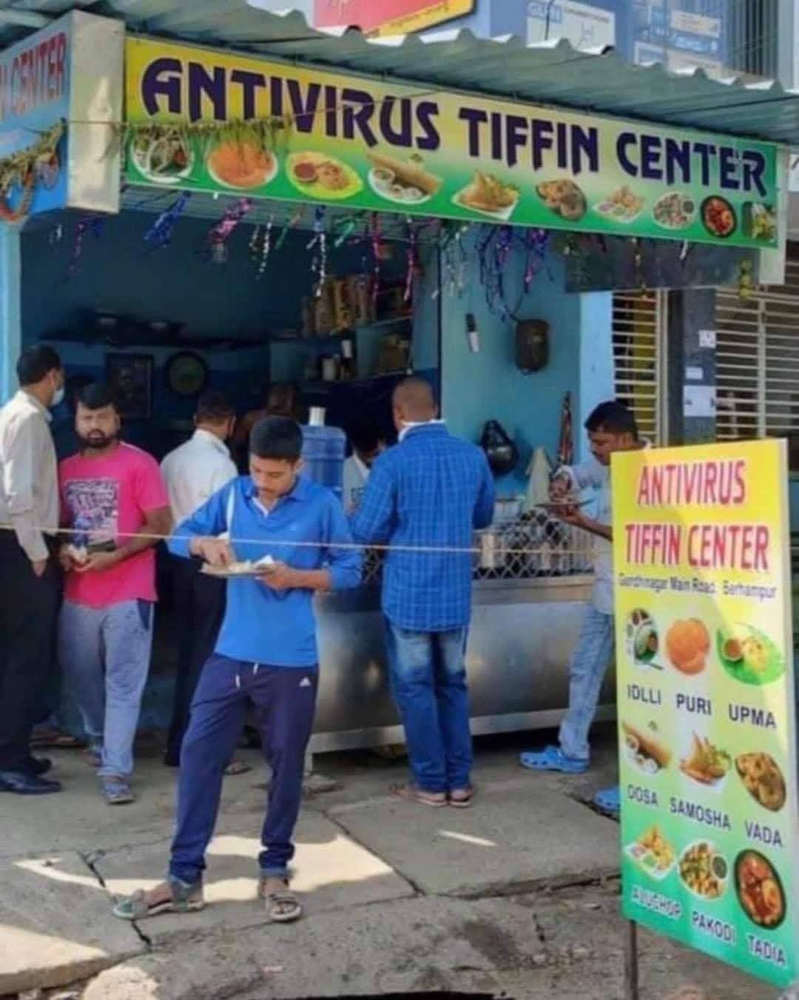
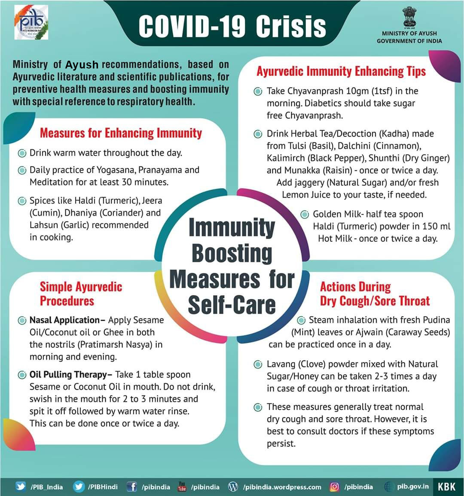

Obviously India has been through the wringer recently with a huge increase in the number of COVID cases, and deaths, in the country. Thankfully the number of active cases is dropping, but at its peak around four and a half thousand people were dying per day, and there have been over three hundred and eighty thousand reported deaths so far - although many experts fear the real total is likely to be much higher.

<!-- more -->

India is also well known for its widespread use of a variety of unproven therapies, including homeopathy, Ayurveda and acupuncture. So, it’s [unsurprising to hear](https://www.rnz.co.nz/news/world/442665/covid-19-india-s-fight-against-cow-dung-and-other-misinformation) that there are some people in India unscrupulous enough to sell some pretty daft COVID cures to desperate innocent people.

In line with India’s fascination with cows, cow dung, urine and milk are gaining in popularity as treatments - smearing yourself in dung and milk, and drinking diluted urine.

<template-embed-tweet value="https://twitter.com/yadavakhilesh/status/1392377613780279297" />

The Indian Medical Association has warned that not only will these treatments not cure COVID, but they carry the very real risk of spreading other diseases. And the last thing you want when your body is busy fighting a potentially deadly virus is more disease.

Sadly, it’s not just grifters in India who are promoting alternative treatments like Ayurvedic herbs. Coronil, a herbal concoction, has been touted first by a popular yoga guru called Baba Ramdev, and later by government Ministers, as an effective cure. These claims are accompanied by talk of a scientific study proving that the herbs work, but the study was performed on fish and its conclusions were basically that before selling the product as a COVID cure it needed to be tested on humans. AYUSH, the Indian ministry for alternative medicine, appears to have been duped into approving Coronil as a “supporting measure” for COVID. And India’s Health Minister was present at last year’s launch event, where the company claimed Coronil will cure COVID within 7 days with a “100% guarantee”.

Because of the recent medical oxygen shortage in India, many members of the public have been looking for ways to boost their oxygen levels. [One Minister promoted](https://www.bbc.com/news/world-asia-india-56925650) a camphor based product as a way to get extra oxygen - camphor is not something anyone should be swallowing. An ex-minister promoted two drops of lemon juice in the nostrils, and Baba Ramdev promoted simply taking two deep breaths. None of these will help anyone who is having problems getting enough oxygen due to COVID infection.

I’ve also seen photos shared by Babu Gogineni on Facebook of indian restaurants selling chutney, dosas and other foods that are claimed to have COVID killing properties:

So, why is the government not stopping this? It seems that, since 2014, the ruling BJP party have been actively working to promote local alternative medicine to the Indian public, creating the [Ministry of Ayush](https://www.ayush.gov.in/) which in the middle of a pandemic is pushing a whole raft of unproven COVID treatments and preventions, including warm water, garlic, turmeric, oil pulling and ghee up the nose.

Sadly, this seems to be the way things can go when governments legitimise alternative medicines that have not been through the same rigorous scientific testing that pharmaceuticals have to go through. We’re a lot better off in New Zealand, but sadly we seem to be moving slowly in the wrong direction, with several of the better known alternative therapies lobbying for more recognition. I fear it’s only a matter of time before our government is providing a wasteful side serving of placebo via acupuncture or chiropractic alongside interventions that actually work. After all, if you ask an acupuncturist what conditions their treatments are good for, the answer is usually “everything” - and that’s not science, it’s wishful thinking.
