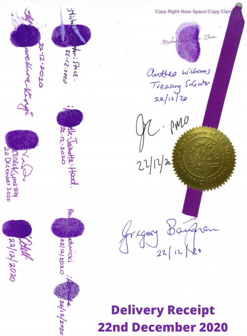

I wrote a couple of weeks ago about lawyer Liz Lambert’s effort to claim a small part of New Zealand - the Abel Tasman National Park - as her own property, which she’s called New Freeland. Well, it turns out that she’s worried about an organisation who have not just claimed Allodial Title over a piece of land, but have claimed sovereignty over the entirety of New Zealand. Liz [has been warning](https://podcasts.google.com/feed/aHR0cHM6Ly9mZWVkLnBvZGJlYW4uY29tL2xpYmVydHluei9mZWVkLnhtbA/episode/bGliZXJ0eW56LnBvZGJlYW4uY29tLzgzMzU1ZGIzLTUwYTEtMzlmMi04ZjlmLWU0NGU2ZDkyNDIyMw?sa=X&ved=0CAUQkfYCahcKEwiA57KS6LzxAhUAAAAAHQAAAAAQEQ) anyone who will listen that this rival group, the [Crown of the Mauri Nation](https://mauricrown.org/), have secretly entered into an agreement with the government to hand over the keys to our country.

<!-- more -->

Her evidence for this? A PDF document hosted on the Mauri Crown website which Liz says has been signed by the leaders of the group - including Michael Stace (from Billy TK’s political party) and Lady Crown, along with several government officials, including the Treasury Solicitor and none other than the Prime Minister.

Apparently the initials JC, from someone at the PMO (Prime Minister’s office), stand for Jacinda Crisci, which we’re meant to believe is an alternative family name used by Jacinda Ardern.

[https://mauricrown.org/royal-decree/21-royal-decree-and-orders-only-22-12-2020/file](https://mauricrown.org/royal-decree/21-royal-decree-and-orders-only-22-12-2020/file)

What this conspiracy fails to mention, which is obvious at the bottom of the page, is that, regardless of who may have signed it (with all the pomp and circumstance of purple thumb prints, names with colons and brackets, etc), the page is just a delivery receipt - nothing more. It seems that copies of this official looking document were delivered to the government a while ago, and that representatives were asked to sign to confirm they’d received their copies. This isn’t a signed agreement, as Liz seems to be telling everyone - just some senior government employees being polite to a group of conspiracy minded people who have no grasp of the law, and who have ended up writing pages and pages of pseudo-legal wiffle:

> “The New Zealand Treasury, representative of HER MAJESTY THE QUEEN IN RIGHT OF NEW ZEALAND SEC CIK #0000216105 have failed to [re]spond/[re]but to the [o]rders,  claims/[de]mands; this qualifies tacit-[a]dmission, which is consent, a]ccepted-by-[e]quitable-[e]stoppel-by-[a]cquiescence;”

However, Liz is at least correct that, if this was an agreement to hand over the rights to New Zealand to Lady Crown, it would be a bad thing for New Zealand. Apparently, as of November last year, the Queen of England and her family and staff (presumably including all government employees) are trespassing and are to be “jailed for the term of your natural life without mercy”.

The queen is also required to pay back a rather large sum of money - nine hundred and eighty nine quattuordecillion Australian dollars:

> AU$989,966,759,239,919,997,499,539,969,945,639,199,559,111,599,999

Firstly, there’s a curious amount of nines in the number - I think maybe there’s some numerology going on, possibly someone who thinks 9 is a lucky number. There are as many 9s in the number as there are all the other digits combined - 24 of them:

> 866752317453645631551115
>
> 999999999999999999999999

In an attempt to try and get my head around this number, I tried to divide it by some other large numbers and place it in context. So…

If every person on the planet (8 billion) earned the entire GDP of the world (US$80 trillion) every second, the stars in the universe would run out of fuel (120 trillion years) before we could all earn this much money together.

Or, looking at it another way, according to stats I found in parts of the web, there’s 2 million tonnes of mineable gold on earth, approximately 100 million earths worth of gold in our galaxy, and 1 trillion galaxies in the observable universe. At today’s price of gold, the queen would need 63 trillion universes to be able to mine all the gold she would need to pay this off.

The [full document](https://mauricrown.org/royal-decree/13-royal-decree-proclamation/file) is 48 pages of pseudo-legal mumbo jumbo, quoting the Bible, Wikipedia and the Crimes Act, and must have taken a long time for these people to put together. I suppose we can be thankful that at least some conspiracy theorists are wasting their time on this kind of relatively harmless nonsense, rather than trying to convince people to not get vaccinated.
