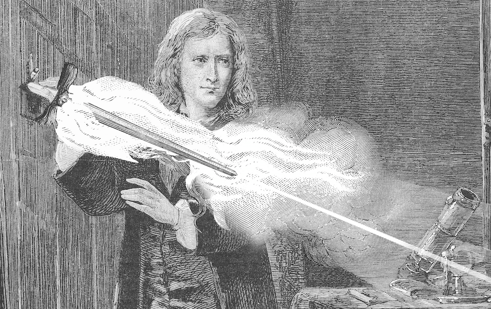

During lockdown, the Wellington Skeptics in the Pub group have been meeting online every week. It’s been great to be able to continue our social meetings, but I also think it’s a really good way to keep us all sane! That connection of being able to chat and have a fun social time with others seems to be really good at helping with feelings of isolation and worry that lockdown can bring to some of us.

<!-- more -->

At our meeting just over a week ago, someone mentioned that they’d been reading up on "theological noncognitivism", and wondered what everybody thought about the idea. Of course, we were all at our computers (after all, it’s a Zoom meeting) so someone shared the link to [the Wikipedia page](https://en.wikipedia.org/wiki/Theological_noncognitivism) and everyone immediately jumped on the page and started reading. After a few minutes talking about the idea that concepts of god may be necessarily nonsensical, someone noticed a much more interesting sounding idea at the bottom of the page: [Newton’s Flaming Laser Sword](https://en.wikipedia.org/wiki/Mike_Alder#Newton's_Flaming_Laser_Sword).

Of course, we all loved the name of this philosophical razor, so named because a laser sword is supposedly sharper than a razor. If you’re interested in understanding this idea, that it’s futile to argue over something if it can’t be tested, I can highly recommend reading the [original article](https://philosophynow.org/issues/46/Newtons_Flaming_Laser_Sword) written by Alder - it’s not only erudite, but is also very funny. And Alder’s article ends with an important warning worth heeding:

> _"While the Newtonian insistence on ensuring that any statement is testable by observation (or has logical consequences which are so testable) undoubtedly cuts out the crap, it also seems to cut out almost everything else as well. Newton’s Laser Sword should therefore be used very cautiously."_

All of this is a very long-winded way of invite readers, wherever in the country you are (or overseas), to join our [Wellington Skeptics in the Pub](https://www.meetup.com/Wellington-Skeptics-in-the-Pub) meetup group and RSVP for our next weekly online meeting. I’ll be there, with a beer or two, and if you’ve been to any of our events over the last ten years or so you’ll probably recognise some of the others there.

My intellectual contribution to the conversation was to change my Zoom background to a picture of Sir Isaac Newton with a laser sword.
