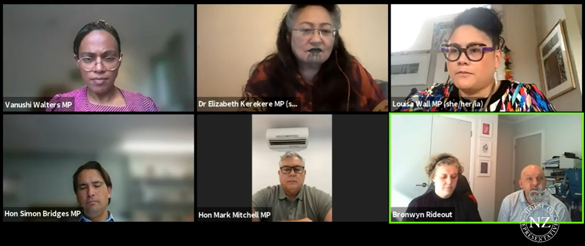

Following on from the NZ Skeptics' submission to the Justice Select Committee a couple of weeks ago on the Conversion Practices Prohibition Legislation Bill (outlawing Conversion Therapy), myself and Bronwyn Rideout from the NZ Skeptics committee gave an oral submission to some of the Justice Select Committee last week. I was surprised that oral submissions started so quickly after the deadline for written submissions, but thankfully in very little time we were able to put together an oral submission that was complementary to our written one, but different enough that we weren’t just boring the MPs with the same information they’d already read from us.

<!-- more -->

The submissions were all online, and we were given 10 minutes to talk - sandwiched between a coalition of Korean churches (who said that being gay is "wrong", and that it should be their right to use a disproven, harmful therapy on their children) and the Young Nationals (who told MPs their membership were totally on board with the banning of conversion therapy, due to how harmful it can be and the lack of evidence of efficacy).

As skeptics we detailed some of the evidence that conversion therapy does not work, and also made sure to mention its harms. We then went on to talk about our broad approval of the new legislation, and mentioned some of the changes we would like to see made to it.

As an example, there is currently an exemption for healthcare practitioners. MP Vanushi Walters explained that it was assumed that the existing codes of ethics created by professional bodies for the various professions listed in the HPCA (Healthcare Practitioners Competence Assurance) Act would cover healthcare practitioners who were offering conversion therapy. We countered that our experience of these bodies suggests that they’re not always quick to take action when complaints are made, and that often no fault is found even when there’s a clear breach of conduct. Therefore our recommendation was to remove the exemption for healthcare practitioners from the new legislation before it becomes law.

You can read the text that was the basis of our oral submission [on the NZ Skeptics' website](https://skeptics.nz/submissions/conversion-oral).
