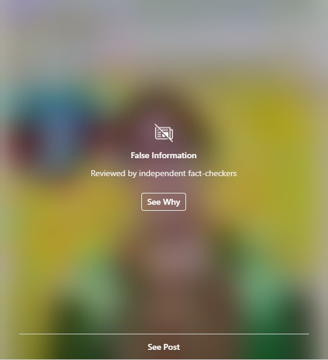
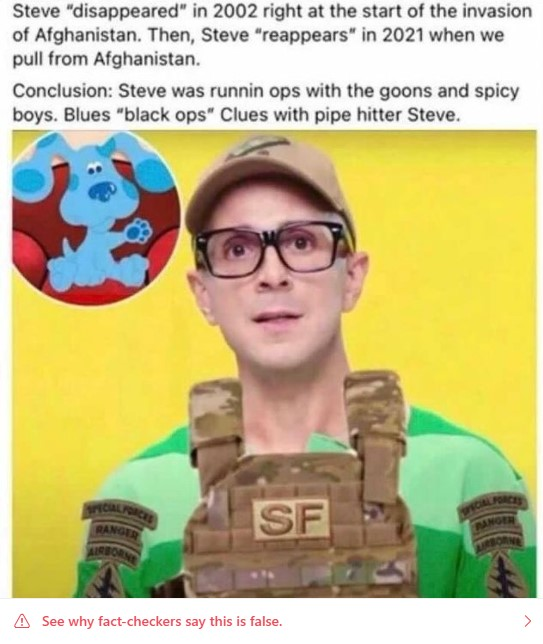

I have three school age kids, and so I’m no stranger to Blue’s Clues. I’ve watched many episodes with both Steve (Steve Burns) and Joe (Donovan Patton) hosting the show alongside the animated dog Blue, following the clues each week. Steve left the show back in 2002, but he made the news recently when he released a feel-good video:

<!-- more -->

@[youtube](https://www.youtube.com/watch?v=zotoTKJ3ivE)

On the back of this, there has been some online speculation that Steve left the show not to go to college, as he says in his video, but to join the army and serve in the middle east. This speculation was fueled in part by a series of edits to [Steve’s Wikipedia page](https://en.wikipedia.org/wiki/Steve_Burns) just over a week ago, variously claiming he was:

- _serving as an operator in clandestine operations against the Taliban from 2002 to 2021_
- _the CIA station chief for Islamabad Pakistan_
- _serving with Special Forces in Afghanistan fighting the Taliban and Al Qada from 2002 to 2021_
- _[in] the French Foreign Legion, where he would begin his own war on terror under the name Hugh Janus_

I think the last one in particular gives the game away, given the rude pseudonym.

There was also an image shared to Instagram that showed a screenshot of Steve in the show, wearing his signature green striped shirt and with a badly photoshopped US military vest and patches pasted on it. However, when you open the image you now see a blurred version with a warning saying “False Information. Reviewed by independent fact-checkers”:

Clicking on the See Post link opens the image, which has another link to the fact-check warning saying “See why fact-checkers say this is false”:

The text of the warning, from USA Today, lets people know that the image is not genuine:

> False
>
> Independent fact-checkers say this information has no basis in fact.
>
> Fact-Checker: USA TODAY
>
> Conclusion: False
>
> More Information: [Fact check: False claim that Steve Burns left 'Blue's Clues' for Afghanistan war](https://www.usatoday.com/story/news/factcheck/2021/09/17/fact-check-blues-clues-steve-burns-created-music-after-leaving/8331724002/)
>
> Learn more about how Instagram is working with independent fact-checkers to reduce false information.

Although in this case it seems obvious that the image is fake, and that maybe a “fact check” was not needed to debunk a badly photoshopped internet joke, it’s still great to see that there are news agencies who have the ability, and staff, to add these kinds of warnings to Instagram images. I’m sure many of you have seen similar warnings on Facebook, Twitter and other social media sites as well.

In the age of weaponised misinformation being used against entire countries, tools like this that allow the countering of misinformation are going to be an important part of the effort to help people avoid falling down rabbit holes of misinformation. I’m sure most of us have at least one family member who, through social media, has gone from just believing in one pseudoscientific idea to spreading all kinds of nonsense through their posts and shares.

Of course, this is not to say that this kind of fact checking is sufficient to fix the problem of disinformation campaigns. And these fact checking services don’t excuse the harm that social media companies often cause when they feed people nonsense as a way to keep them engaged and maximise the number of adverts they’re able to show you. But it’s a start at least, and it’s fascinating to see that even silly internet jokes need to be debunked, lest people actually believe them and end up with a warped world view where the “mainstream media” are hiding the truth from them.

I’ll leave you all with the wise words of Steve and Blue:

> _Now it's time for so long, But we're gonna sing one more song_
>
> _Thanks for doing your part, you sure are smart_
>
> _You sure worked hard_
>
> _When you use your mind, Take a step at a time_
>
> _You can do anything that you wanna do_
