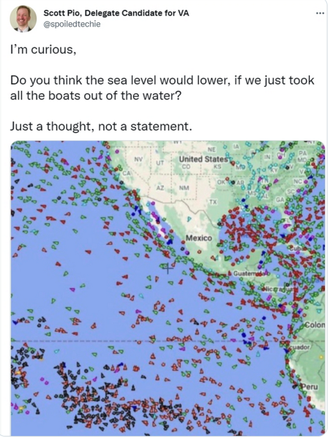

One of the many effects of climate change is that the oceans are rising. This is going to be an increasing problem for coastal settlements and island nations. But one American political candidate who has worked for Trump in the past, Scott Pio, thinks he’s [figured out an answer to the problem](https://www.independent.co.uk/climate-change/news/virginia-scott-pio-sea-levels-b1937355.html), and posted his idea on Twitter:

<!-- more -->



When challenged he deleted his original tweet, but later [posted a clarification](https://twitter.com/spoiledtechie/status/1447572348475957253):

<embed-tweet value="https://twitter.com/spoiledtechie/status/1447572348475957253" />

```
“When you take things out of bath water, the bath water decreases, does it not? Got a lot of hate from your group for asking a question about taking things out of the water. Curious when you stopped believing in pure physics? I guess you don’t believe in science experiments?”
```

So, someone was good enough to do the maths on this one, and calculated that if every vessel was removed from the ocean, the sea level would drop by about 0.006mm - and after about 16 hours warming will have caused the sea level to rise back to its original height.

Weirdly, this is not the first time I’ve heard this idea. Someone told me a few months ago of a conversation they had at a party where one of the guests suggested the same idea - that sea levels are rising because of the number of boats we’re putting in the ocean, not climate change, and that we could fix the problem of sea level rise by taking them back out again.

I suppose at least these people are not denying that the sea levels are rising, or claiming that our current CO2 output is good for the planet or that sun cycles are the reason for our changing climate. That takes a special kind of wilful ignorance of science and evidence.
