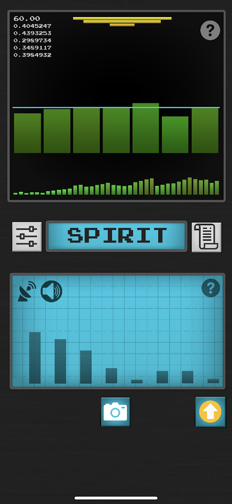
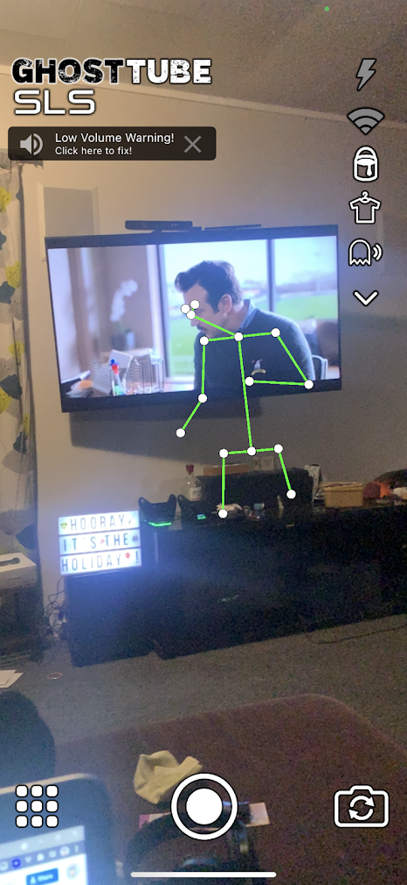
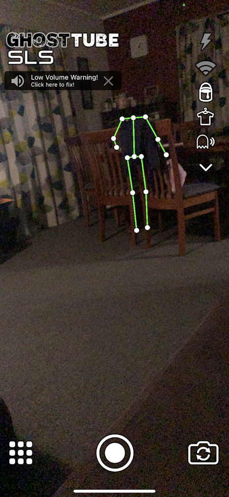

The BBC (in its travel section) has an [interesting article](https://www.bbc.com/travel/article/20211028-the-skirvin-the-us-most-haunted-hotel) on the Skirvin hotel in Oklahoma, supposedly the most haunted hotel in the US. The article talks a little about the hotel and the ghosts that supposedly haunt it, and then details how the journalist paid for a ghost hunting couple to come and see if the hotel was really haunted. Things have changed in the ghost hunting world - where historically ghost hunters have used physical devices to record "anomalies" such as temperature changes, Electromagnetic Frequency (EMF) fluctuations and the like, these modern day ghost hunters have an app for that - or rather several apps, of which they mention the names of two of them in the article. So I figured that, as a skeptic, I really should take them for a test drive and see what they can do.

<!-- more -->

I first tried the Ghost Hunting Tools app, which draws some bar charts on the screen and occasionally shows a word. Supposedly the app is reading EMF, including FM radio channels, to tune in to ghosts in the area (like a spirit box), and then converting those into words.

I received the words "Screeching Flat Nail Cody Stabbed Jordan Far Falls Opening Muse No Arrested Spirit" when I tried the app in my kitchen for a few minutes. These come from a pre-defined dictionary of only around 2,000 words that the app knows. What struck me was that the app has been seeded with what appears to be a set of North American names among its very limited dictionary - there are not very many Codys in New Zealand, and none born before 1982 - with Jordan appearing in 1980. I’m sure if people try to read some meaning into these word lists, they could make a story that might feel like it’s describing an incident that ended with someone being murdered. "Cody Stabbed Jordan" in my word list seems pretty suggestive!

Next I tried GhostTube SLS (Structured Light Sensor), which is an app that appears to use some of the more recent features of phones, like LIDAR and dual lens cameras, for depth-sense detection of objects in 3D space. The app looks for tell-tale signs of people within the camera frame - and I think it’s using some software that Apple has built in to my iPhone to detect people that’s useful for Augmented Reality apps. I tried the app in my living room, and it did well - it recognised me as a person, and then it recognised the TV character Ted Lasso on my TV screen as well, drawing in fake arms and legs with green lines overlaid on top of the camera feed:

It then saw a headless person when there was noone else in the room with me - between two chairs in my dining area:

I can definitely see this one being a popular app with ghost hunters - it’s basically a human detection algorithm that’s been cranked up to 11. The software tries so hard to find humans in the picture it’s looking at that it sees people who aren’t there. Anything that looks vaguely like it could be an arm or two, or a leg and torso, gets extrapolated into a green wire frame drawing of an entire human being. For ghost hunters, these stick men that show up on their phones are assumed to be ghosts that the app is picking up. For me, it took a couple of minutes of playing with the app and 30 seconds of googling to find out that Apple recently [added people recognition](https://www.forbes.com/sites/stevenaquino/2020/10/30/apple-adds-new-ar-enhanced-people-detection-accessibility-feature-to-ios-142-developer-beta) to its phone API to help blind and low vision phone users to detect people around them.

@[youtube](https://www.youtube.com/watch?v=WtP2t6aNnOc&t=138s)

It’s interesting, since I last looked at ghost hunting apps on phones a few years ago, just how many new apps have popped up now that phones have an increased number of sensors. Sadly, it seems that these apps are abusing people’s trust to make them think they’re detecting ghosts, when in reality spooky happenings are deliberately engineered in the software - and not from the aether.

We’ll leave the last word on this to an actual expert - Dr Bryan Farha, director of applied behavioural studies at Oklahoma City University (and a proper paranormal researcher), said:

> _"I walked every inch of every floor and found nothing of substance. And I did so under the creepiest of conditions – before the restoration, below freezing with the electricity shut off, so a flashlight was the only means of visibility most of the time. Still, nothing was found. Just an old, empty, cold hotel." _
