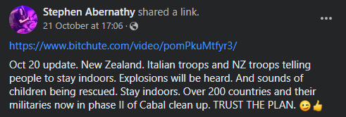
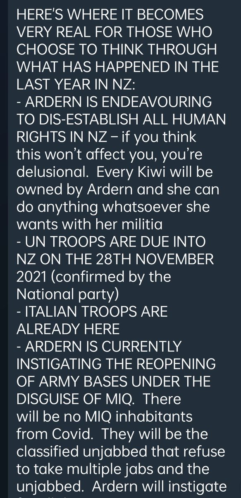
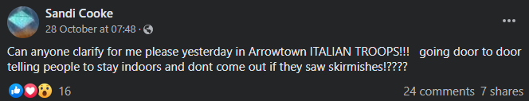
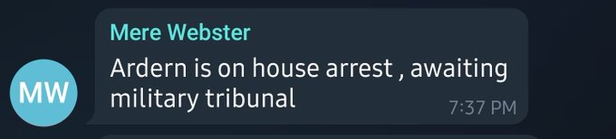
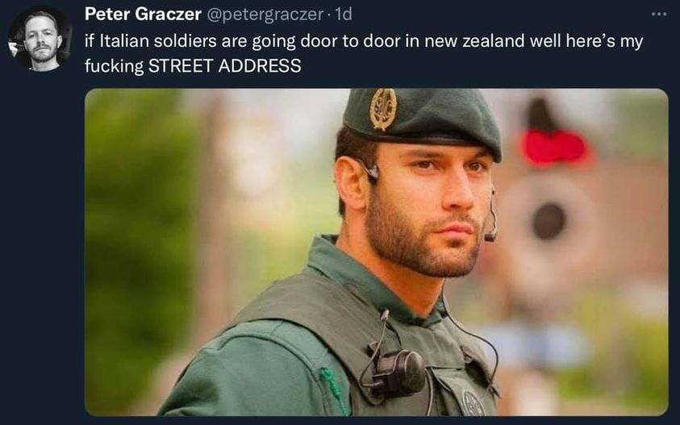

There’s a rumour going around in conspiracy circles that the UN, and/or Italian soldiers, are due to come to New Zealand at the end of November, or that they might already be here.

<!-- more -->

It’s not obvious what the troops are for. Some people think that Jacinda Ardern has invited them in to the country to crack down on dissenters who are refusing the COVID vaccine. Others are suggesting that Jacinda will be arrested and tried for war crimes.

[https://www.facebook.com/sandi.cooke.3/posts/4410900585659775](https://www.facebook.com/sandi.cooke.3/posts/4410900585659775)

[https://www.facebook.com/groups/TrumpCard17/posts/1540897559593045/](https://www.facebook.com/groups/TrumpCard17/posts/1540897559593045/)

Obviously none of this is happening, but I was interested to find out where the idea came from. It took me a little while to find the source of this silliness, and it’s a man from the UK called [Simon Parkes](https://www.simonparkes.org/):

[https://www.bitchute.com/video/kRHjsy9m9KE3](https://www.bitchute.com/video/kRHjsy9m9KE3)

Simon is known in the UK for having been a Labour councillor in Whitby... and for having claimed that his adoptive mother was a 9ft tall alien, and that he fathered an alien baby with an alien called the Cat Queen. He’s also a QAnon believer and thinks that Electromagnetic Frequencies are making us all sick. He runs a YouTube channel called Connecting Consciousness where he just asserts all sorts of nonsense without any evidence - and this one particular video, mentioning New Zealand, seems to have been swallowed hook, line and sinker by our local conspiracy theorists.

Although Simon says he’s not going to give a date, the date of November the 28th has been widely circulated through social media. And his words have been added to in online transcripts of the video, saying:

> _"There will be mercenary action by the Deep State, specifically in Auckland and Christchurch but also other areas… Major notable landmarks will be destroyed as they are associated with the Deep State. Thousands of children have been removed from the tunnels. There will be action here as NZ is used as a bolt hole by rich Americans."_

- [https://www.facebook.com/aniheraangela/posts/5228247210522237](https://www.facebook.com/aniheraangela/posts/5228247210522237)
- [https://www.facebook.com/AlchemyForTheSoul/posts/343170874272928](https://www.facebook.com/AlchemyForTheSoul/posts/343170874272928)

Thankfully, with the internet being what it is, many Kiwis have taken to Twitter and Facebook to welcome these Italian soldiers, and have accompanied their posts with pictures of sexy looking military personnel. I love how there are so many sensible people in this country who understand that making fun of nonsense is often a good way to take the wind out of its sails.

