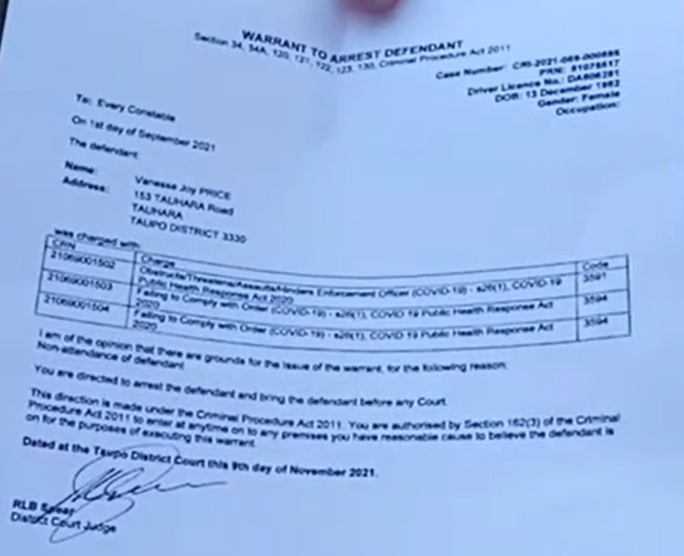

So I want to talk about an interesting arrest that happened yesterday, but not the arrest of Brian and Hannah Tamaki.

<!-- more -->

@[youtube](https://www.youtube.com/watch?v=g7pAmEjIXKM)

A woman called Vanessa Price was visited by the police yesterday morning, and they had come to arrest her for failure to turn up for a court appearance. She tried arguing with the police, but thankfully they were [having none of it](https://www.facebook.com/vanessa.winter.505/videos/876010189947855/).

There are some telltale signs in that video that Vanessa is a believer in the Sovereign Citizen movement - now, we’ve talked about this before, the idea that there are legal tricks you can use to avoid paying tax or being arrested. Vanessa talks of a "legal name", which suggests that she’s a believer in the idea that the government creates a "straw man" company using each of our names when we sign up for a passport or driver’s license. And it’s only through this legal entity that the government can tax us or police us.

She goes on to tell the police that before she leaves for the police station, she needs to give her dogs some homeopathic medicine. As an aside, it’s interesting that when people believe in one bad idea, they often turn out to believe in other bad ideas as well. And sure enough, a quick browse of her Facebook feed shows she’s into a weird mix of vaguely spiritual nonsense, hardcore conspiracies and dangerous medical claims.

After spending the day yesterday waiting to appear in court, Vanessa was released and immediately [posted another video](https://www.facebook.com/vanessa.winter.505/videos/423708532740620). In this video we can hear her talking about the "legal name" of Vanessa Joy Price, which she calls a "fictional character", and then she lists off what she thinks is her "living being" name - the one that allows her to avoid prosecution:

I love how she finishes off talking about how the Judge has told her that her efforts, including documents filed to the court, are _"legal jibber jabber"_. It’s obvious from this that, like the police, the courts are not keen to put up with her Sovereign Citizen (or Freeman of the Land) nonsense. It’s sad that Vanessa has convinced herself that this legal voodoo is real, because there’s a real chance it’s going to land her in prison.
