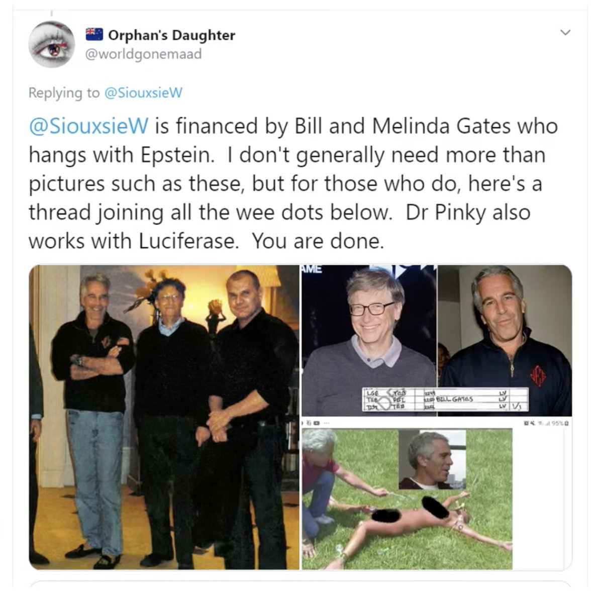

We had a great conference on the weekend, which was a live streamed conference shared with the Australian Skeptics. It’s the first online conference I’ve run, or been to even, and although there were a few technical hiccups, the weekend went well with over two hundred attendees from not just here and Australia, but also from several other countries around the world.

<!-- more -->

Day one started with Dr Mahmood Hikmet talking about self-driving cars and ethics. In relation to the trolley problem, and many similar quandaries that a self-driving vehicle might find itself in, Mahmood pointed out that often the safest option available is simply for the AI to apply the brakes! However, when it comes to real-world problems, things get more complicated.

Later in the morning Dr Siouxsie Wiles talked about how her name became attached to a [COVID conspiracy](https://www.stuff.co.nz/national/health/coronavirus/300239727/siouxsie-sorry-i-dont-supply-covid-testing-services) about Bill Gates and a company she started to make science communication videos called Lucy Ferrin - the name was chosen because it sounds like Luciferin, a chemical used by various creatures to glow in the dark. And the name Lucifer means light bringer, hence its use in naming the chemical. But, of course, to the conspiracy theorists this was proof that Siouxsie is in league with the devil.

(It reminded me of another conspiracy about her I heard this year, on the Counterspin conspiracy show. Damien De Ment claimed that Siouxsie’s work in bioluminescence was going to be used in the COVID vaccine so that we would not need a vaccine passport - instead, the authorities would just be able to shine a special light on us, and if we glowed they would know we had been vaccinated.)

At the end of the first day, Gideon Meyerowitz-Katz gave a great talk about Ivermectin - detailing why people believed it was useful for treating COVID, how the evidence quickly came to show that it was not efficacious, and how some anonymously run websites like [IVM Meta](https://ivmmeta.com/) continued to support Ivermectin use even after it became obvious it was a dud.

On day two, Sherrie D’Souza told us about some of the dangers of cults, and detailed her journey leaving the Jehovah’s Witnesses. She played a [particularly odious video](https://www.jw.org/en/bible-teachings/children/become-jehovahs-friend/videos/should-we-celebrate-birthdays/) from the JWs which tells kids why they won’t be allowed to celebrate their birthday.

Our conference came to a close with a fantastic talk from Judy Melinek and her husband TJ Mitchell about forensic pathology in the US and New Zealand. Their talk was informative and entertaining, and it was obvious that Judy is a consummate professional with real passion for her career, and that her husband has a keen interest in her work. They’ve even collaborated to [write a biography](https://drworkingstiff.com/), along with two fictional crime novels that don’t mangle the science. They are an engaging, enthusiastic and competent couple - we’re lucky to have them in our country.
