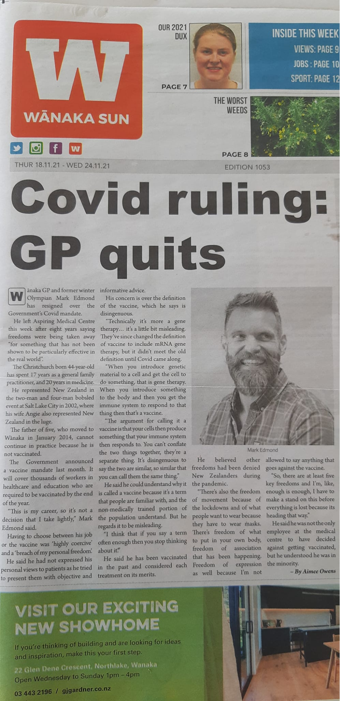

Last night at about 1am a friend of mine sent me a link to a brand new COVID website called [Wanaka Health Bridge](https://www.wanakahealthbridge.co.nz/). I clicked on the link, and saw that the site talks about the risks resulting from Wanaka being three and half hours from a major hospital, and what that means for COVID-19 treatment. The website says:

<!-- more -->

> _"Welcome to Wanaka Health Bridge_
>
> _We’re a collective of individuals from the Wanaka community, bringing together our own specialist health and wellbeing knowledge, to empower the Wanaka community and support their own journey as together we face the inevitable influx of COVID-19"_

So far, so good… but, I figured, there’s going to be a catch. After all, why would my skeptical friend send this to me if it’s a legitimate website? And, as I scrolled down, it became clear that the site is not offering good health advice. Nope, it’s recommending foods and supplements that will supposedly protect you from COVID or treat it.

The list on the site includes ways to boost your immune system (hot lemon, ginger, honey), reduce your viral load (colloidal silver, manuka), fight viruses (mushrooms, garlic, ginger, thyme) and reduce clotting (turmeric, cayenne, garlic). None of this is evidence-based, and the website’s References page points to a few bad studies and some dangerous looking treatment protocols from unqualified healers.

This is not the quality of advice or evidence you’d expect from some of the names at the bottom of the website - Dr Mark Edmond, a GP, Harnan Sudan and Aaron Heath, both pharmacists. But it is the kind of thing I’d expect from some of the other names - a naturopath, a herbalist, a chiropractor, a yoga teacher, a graphic designer and a web designer. None of those people have any relevant expertise, and none of them should be giving out COVID advice.

Seeing the GP in that list reminded me of a post that was shared by a friend and fellow member of the Skeptics recently - sure enough, she shared an article from the Wanaka Sun about Mark Edmond quitting, along with the comment "_Good riddance to our local antivax GP_".

The article talks about how Mark was an olympic athlete and became a GP 17 years ago, moving to Wanaka in 2014. Mark has recently lost his job because he refuses to be vaccinated. In the article Mark mistakenly calls mRNA vaccines gene therapy, which shows that maybe he wasn’t paying a lot of attention during vaccine day at medical school. It’s sad that, not content with making a bad personal choice, he’s using this Wanaka Health Bridge website to try to convince other people to make bad choices. No, shiitake mushrooms and ginger will not fight the COVID virus. But a vaccine, like the one Dr Mark Edmond has refused to take, will help to protect you.

Despite all this nonsense, there’s some good news. Wanaka is part of the Queenstown-Lakes district, which just last week became the first district in NZ to reach 90% double vaccinated - just ahead of Wellington. ~~They have won a Herald Top Towns competition for this achievement, and the Herald have commissioned a poster in celebration for tomorrow’s edition of the paper. I guess that the tourist industry down south is important enough that people have managed to look past the odd anti-vaccine health professional and make a sensible decision that will help protect everyone’s livelihoods.~~
