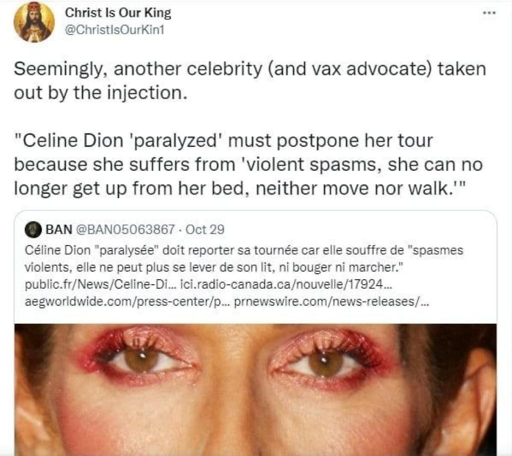

I was talking to a friend on the weekend who works as a tradesman. He asked me, as a skeptic, what I thought of the coronavirus vaccine - did I think it was dangerous? And was COVID real? He’s pretty sure the scientists aren’t lying to him, but he’s talked with a lot of colleagues who aren’t so sure. Most of my friends are fairly skeptical, and a lot of the time I breathe the rarefied air of skepticism, so it was interesting to hear a perspective that I don’t really come in contact with in my daily life - a friend who’s intelligent but has heard enough misinformation from the anti-vaccine crowd that he’s becoming a little unsure.

<!-- more -->

After our conversation, the next morning, he forwarded me a copy of a screenshot he’d been sent - a news story saying that Celine Dion has had to postpone a tour because she has been suffering from muscle spasms - and that the COVID vaccine is the reason for her horrible symptoms.

He asked me if I could find anything to prove this statement wrong, so of course I immediately started googling.

The first thing I found was several articles about Celine Dion cancelling a residency in Las Vegas because of health issues - specifically muscle spasms. None of the articles talked about the cause of her problems, but it turns out that at least half of this story is true. So, what about the other half? Was the vaccine the cause? I found a few [fact](https://leadstories.com/hoax-alert/2021/10/fact-check-no-evidence-celine-dion-was-severely-injured-by-vaccine.html) [checking](https://www.ibtimes.sg/fact-check-did-celine-dion-cancel-las-vegas-show-because-injury-after-taking-covid-19-vaccine-60934) [sites](https://www.politifact.com/factchecks/2021/nov/29/viral-image/baseless-claims-about-covid-19-vaccine-paralysis-a/) which debunked this specific rumour, dating back to October, but the articles didn’t have any proof that this wasn’t a case of vaccine injury.

But does it matter that I couldn’t find any kind of statement from Celine Dion refuting the claim that she’s been damaged by the vaccine? No, it doesn’t.

There’s an important skeptical mantra to remember here, about the onus of proof. If someone’s making a claim without any evidence, it’s not up to you to prove them wrong - the onus of proof is on them, as the person making the claim; they need to provide evidence to back up their claim. This has been described eloquently by the late Christopher Hitchens, and is known as [Hitchens’ Razor](https://en.wikipedia.org/wiki/Hitchens%27s_razor):

> _"What can be asserted without evidence can be dismissed without evidence"_

Having said that we don’t need to prove the rumour false, we can still look at its plausibility:

Firstly, the fact that no reputable news source has reported this is telling. Instead, this vaccine injury claim has been solely spreading through social media.

The message my friend received came from an anonymous Twitter account called "[Christ is our King](https://twitter.com/christisourkin1)". Looking at the account, it was only created in April this year, and is supposedly run by a "_Traditional Catholic, Husband & Father_" in Phoenix, Arizona - although a lot of the content posted by the account is about Australia. The account shares other unverified stories of vaccine injury, as well as a lot of conspiracy ideas (like that COVID is engineered by China to kill Christians), and frequently compares people to Nazis.

_Word cloud of common words_

_Posting by hour - matches the Phoenix time zone well (7am to midnight)_

As Celine Dion is in her 50s and currently lives in Nevada, she is likely to have been vaccinated early on this year. Vaccine injuries usually happen immediately after the injection - not months later.

The symptoms also don’t fit what we’d expect from vaccine injury - injuries are expected to be an allergic reaction, which the CDC says would likely include "_rapid heartbeat, difficulty breathing, swelling of the throat, or a generalized rash or hives_".

So, although I can’t prove that this is not a case of vaccine injury, it’s certainly looking like a pretty implausible claim. Plus I can rest easy knowing that it’s not up to me to prove the rumour wrong, it’s up to those who made the rumour to prove that it’s true.

We can leave the last word here to Celine Dion’s sister, who [talked with ABC News](https://abcnews.go.com/GMA/Culture/video/celine-dions-sister-speaks-performers-health-issues-80725032) about the issue. She talks about what actually caused the muscle spasms (the stage), and doesn’t mention the COVID vaccine at all:
