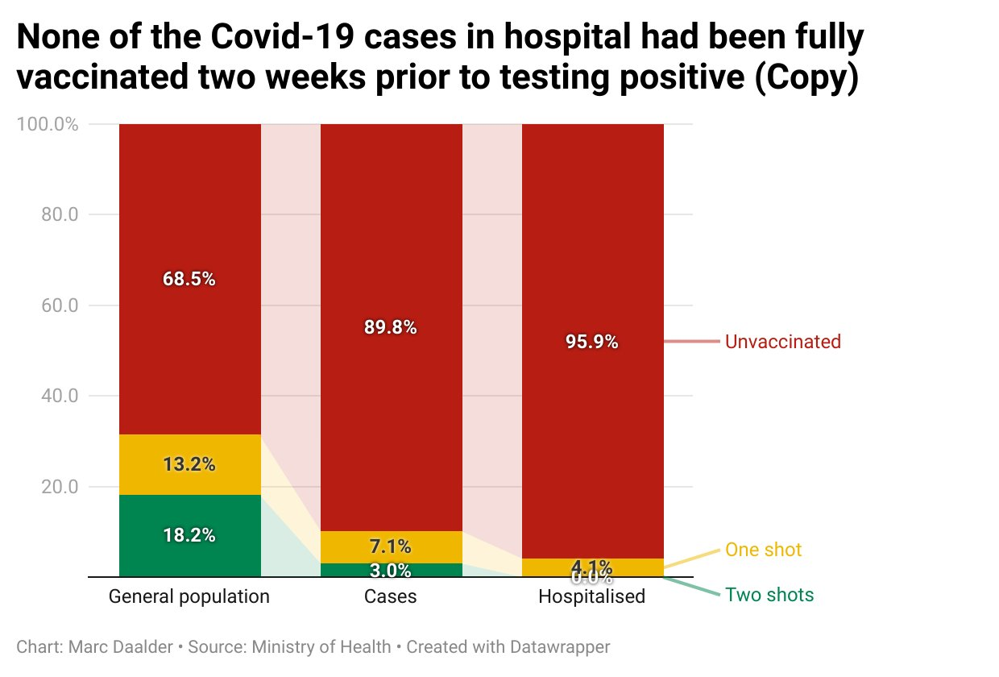

Rex Warwood sadly died late last week. He was a long time reporter and later editor for the Franklin County News, and was apparently well liked. However in recent years he appears to have succumbed to conspiratorial thinking, and became a [vocal critic](https://www.reddit.com/r/HermanCainAward/comments/r4t235/herman_cain_award_new_zealand_edition/) of [vaccination](https://www.reddit.com/r/HermanCainAward/comments/r4u5d8/new_zealand_journalist_exposed_to_imported_and/) against COVID, saying things online such as:

<!-- more -->

- _"Vaccinations have got nothing to do with health. They have been part of a global plan to depopulate the planet, only that won’t become evident for a little while. "_
- _"Consider ivermectin if you think you have the dreaded lurgey (bad flu)."_
- _"Covid is a non-event but the combined governments of the world contrived to make it an industry (event 201, 2019) that will destroy lives and give control to the few in power. God help the vaccinated!! "_
- _"Vaccines are a bio weapon and it will be left to "the few" - the un-vaccinated - to save it from extinction"_

Rex even appears to have [fallen for](https://twitter.com/publicaddress/status/1465443216983945218) the Jacinda Ardern cryptocurrency scam we talked about a couple of weeks ago - a Facebook advert sharing a video which talks about Jacinda being involved in investing $25 million in a cryptocurrency that everyone should invest in. When I say that he fell for the scheme, Rex didn’t invest in it - but he did believe it was real, and thought that Jacinda must be corrupt for having earned $25 million during her time as Prime Minister that she could afford to invest in a cryptocurrency scheme. He said:

> _"This person has been reported as being worth $25 million after being in a job for three years that pays around $450,000 per year… What a coincidence she is now going on advertisements promoting a new "secret" method of earning fabulous money… Time to open the books on all of these politicians who are spending billions on COVID"_

It was quite surprising to hear that Rex had died in Auckland’s North Shore hospital from COVID - a tragic irony that is being repeated all too often around the world at the moment.

In fact, there are a couple of sites that document deaths of anti-vaxxers from COVID.

One is the [Herman Cain Award](https://www.reddit.com/r/HermanCainAward/) sub-reddit - a part of the reddit website where people post stories of those who have died of COVID after calling the virus a hoax or similar. The board is named after an American politician, and 2012 Republican presidential candidate, who was famously skeptical about the use of face masks and caught COVID after attending a Trump rally:

@[youtube](https://www.youtube.com/watch?v=3nj0MxfO1rM)

The site describes the Herman Cain award as:

> _"Nominees have made public declaration of their anti-mask, anti-vax, or Covid-hoax views, followed by admission to hospital for Covid. The Award is granted upon the nominee's release from their Earthly shackles."_

The other site is called [Sorry Anti-Vaxxer](https://www.sorryantivaxxer.com/), and it serves a similar purpose. There’s a disclaimer on its front page which says:

> _"The purpose of this site is educational, except for a few exceptions, everyone listed on this site was/is an anti-vaxxer activist who helped spread COVID-19 misinformation on social media. Share to stop others from making the same mistake. GET VACCINATED!"_

However, despite these lofty aims, I’ve found the tone of both of these websites to be concerning. There’s almost a glee to some of the stories of people dying of COVID. I’m not sure if it would even be possible to make an educational site about COVID deniers dying of the disease that was not offensive, but these two sites have most definitely not managed that.

It’s likely we’ll see more COVID deaths in this country, and the stats we already have show that these deaths will disproportionately be among those who are unvaccinated. I hope we can all be kind, and not gloat about this slowly unfolding, and largely avoidable, tragedy.

