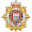

# Mark Honeychurch

**Location:** [Whitby, Porirua, Wellington, New Zealand](https://www.google.co.nz/maps/place/Whitby,+Porirua)

**Mobile:** [+64 21 885 216](tel:+6421885216)

**Email:** [mark@honeychurch.org](mailto:mark@honeychurch.org)

**Website:** [mark.honeychurch.org](https://mark.honeychurch.org)

**Code:** [git.io/markh](https://git.io/markh)

**Nationality:** [British](#) & [New Zealand](#) Citizenship

**Age:** [44](/blog/random/year/)

**CV:** [mark.honeychurch.org/docs/MarkHoneychurchCV.pdf](https://mark.honeychurch.org/docs/MarkHoneychurchCV.pdf)

## Background

The last twelve years have been spent working for an Australian company, Interactive, both as a hardware support engineer and a fullstack software developer. Prior to that I worked as a systems support engineer. Interactive have decided to close their Wellington office, therefore I am looking for a full-time permanent or contract role, working in development or support.

### Competencies

- **Critical thinker** - Able to critically analyse ideas and offer constructive criticisms.
- **Creative problem solver** - Enjoy being given challenging tasks, and will come up with novel but practical solutions to complex problems.
- **Keen and quick learner** - Can research topics and synthesise new information quickly. Enjoy using new technologies, and always seek to know more.
- **Methodical worker** - Able to see projects through design and implementation to completion, and happy working to deadlines.
- **Capable communicator** - Comfortable building and maintaining relationships with both internal and external stakeholders.

### Technical Skills

- Wide experience and knowledge of operating systems, software and hardware.
- Certified on both Windows and Linux
- Experience with cloud services and container based virtualisation.
- Coded solutions in [PHP](https://www.php.net/) and [Python](https://www.python.org/), but in recent years have been developing [JavaScript](https://en.wikipedia.org/wiki/JavaScript) software using [Node.js](https://nodejs.org/).
- Experienced using libraries such as [Express](https://expressjs.com/), [Socket.IO](https://socket.io/), [Axios](https://github.com/axios/axios), [Vue](https://vuejs.org/), [NuxtJS](https://nuxtjs.org/) and [VuePress](https://vuepress.vuejs.org/).
- Can use both SQL and NoSQL databases ([MS SQL](https://www.microsoft.com/en-us/sql-server), [MySQL](https://www.mysql.com/)/[MariaDB](https://mariadb.org/), [MongoDB](https://www.mongodb.com/))
- Knowledgeable in [HTML5](https://en.wikipedia.org/wiki/HTML5) and [CSS3](https://en.wikipedia.org/wiki/Cascading_Style_Sheets), along with several popular HTML/CSS frameworks (including [Bootstrap](https://getbootstrap.com/) and [Material](https://material.io/)).
- Experience supporting server, network and storage hardware.
- Competent in data processing and analysis, and where possible use my programming knowledge to create reusable data analysis tools.

## Education

I have a Master's degree in Engineering, and hold a variety of professional certifications relevant to my career in IT.

### Certifications

|         Cert | Details                                                  |
| -----------: | -------------------------------------------------------- |
|     **LPIC** | LPI Linux Levels 1 & 2 Certified                         |
|      **UCP** | Ubuntu Certified Professional                            |
|     **ITIL** | ITIL Foundation Certified                                |
|      **MCP** | Microsoft Certified Professional - Windows & Clustering  |
|    **MCITP** | Microsoft Certified Information Technology Professional  |
|     **MCTS** | Microsoft Certified Technical Specialist - MS SQL        |
| **W3C HTML** | W3C Certified HTML Developer                             |
|     **ASAP** | NetApp Accredited Storage Architect Professional         |
|     **NCDA** | NetApp Certified Data Management Administrator           |

### Degree: M.Eng (Hons)

 [_University of Bristol_](http://www.bristol.ac.uk/engineering/) **Master's Degree with Honours in Mechanical Engineering** (1994 - 1998)

**Chess Playing Robot.** In the third year, I completed my thesis on a chess-playing robot. This involved extensive programming in Borland Delphi, as well as VAL, a language used to control the PUMA 450 robot arm. During the project I had to work with a CCD camera and video capture software/hardware.

**FEA Software.** My fourth year thesis was on the writing of a Finite Element Analysis package for use within the University. It primarily involved programming in Borland C++ Builder, although parts of a previous year’s program in Visual C++ were also integrated.

## Work Experience

### Hardware Engineer, Software Engineer

 [Interactive](https://interactive.com.au) _Wellington, NZ_ (2007-10 – 2019-10)

My primary role at Interactive was in hardware support, providing a first class service to our New Zealand customers. I covered **HP**, **IBM**, **Dell** and **Sun** servers, as well as **Cisco** networking equipment and **NetApp** and **PureStorage** storage hardware. I installed and supported hardware for many major customers across New Zealand.

During my time at Interactive I also created several software products for in-house consumption:

#### Projects

**_Business Analysis._** I created a dashboard for management allowing a view of the utilisation of all our field engineers. This was accomplished with direct SQL querying of our helpdesk system’s database, along with a web-based front end using **jQuery**, **Bootstrap** and the **D3** graphing library.

**_Rostering Website._** I developed a complex web-based scheduling system for Interactive's on-call rosters, using **Javascript**, **Moment**, **Vuetify**, the **Vue CLI** tool and **C#**.

**_Tracking System._** I created an end-to-end tracking software solution for our engineers, including an **iOS app** for interfacing with a ticketing system and reporting geolocation, a **Node.JS** and **Mongo** backend for data storage, and a **Vue** frontend with websockets for displaying realtime engineer locations and statuses, using **Docker** on **Linux** as a platform.

**_Rapid Development_** I was asked to develop a simple customer portal in 24 hours that would allow one of our customers to access details of their support contract with us. Using **Vue** and **Bootstrap**, and accessing existing data in multiple **Microsoft SQL** databases, I was able to code a secure, modern, responsive website that worked for all of our customers in less than a day.

### Systems Engineer, Server Team Lead

 [gen-i](https://www.sparkdigital.co.nz/) _Wellington, NZ_ (2006-04 – 2007-10)

When I started with gen-i, I provided 2nd and 3rd level support for the ANZ National Bank throughout New Zealand. This support involved both completing work requests and fault fixing. Work requests included maintaining the **Active Directory** environment, providing network shares, building PCs and installing software. Fault fixing covered the whole range of the bank's IT hardware and software, with the hardware mainly consisting of **Compaq/HP** and **Dell** servers, PCs and Laptops, and software running to hundreds of packages. Issues dealt with ranged from dial-up and broadband problems, through OS and application faults to **Exchange** and Active Directory problems.

After several months in the role, I became Technical Lead of gen-i's ANZ Server Support team, looking after all ANZ and NBNZ production servers. This involved a mixture of projects and day-to-day administration of branch and corporate servers, including **backups**, hardware and software problems and routine maintenance. Faults were fixed within SLA and, in alignment with **ITIL** best practice, problem records were created and root causes diagnosed and repaired. Incidents ranged from the relatively simple, such as hardware failures, to the complex, such as troubleshooting NDMP backup problems.

As well as supporting the environment, I supported the other server engineers on the contract – helping with technical issues, running weekly meetings and distributing work when required. I encouraged engineers to gain qualifications and aided them where possible.

#### Projects

**_RightFax Upgrade._** I ran a project to migrate existing RightFax users to a new infrastructure. This process involved the building of new RightFax servers, installation of **Microsoft SQL clusters** (including setup of SAN disks) in both Production and DR environments and the subsequent migration of Fax mailboxes between servers.

### Technician

 [Department of Internal Affairs](http://www.dia.govt.nz/) _Wellington, NZ_ (2005-11 - 2006-04)

At the DIA I supported over 1,000 users in an **Active Directory** and **Lotus Notes** environment, both for the Department of Internal Affairs and the Ministry of Transport. Support was given over the telephone Nationwide, and additionally with site visits within the Wellington CBD area. PCs were generally Windows 2000, with some remote clients using **Citrix**, and the hardware used was mainly **HP/Compaq** Desktops and HP and Ricoh Printers. Supported applications included Microsoft Office, Oracle and Lotus Notes, with Checkpoint VPN-1 and iPass used for remote access.

### Director

 [Spiral Technology](http://www.spiraltechnology.co.uk/) _London, England_ (2003-03 - 2004-11)

During my four years in London a business partner and I set up a company specialising in supplying cost effective IT solutions using mainly Open Source components. Through this work I have a solid understanding of Linux and Content Management Systems, eCommerce Solutions, Photo Galleries and other applications.

I have also been involved in the costing of contracts, responding to tenders, filing of tax returns and many other facets of running a company. I have liaised with customers throughout the life-cycle of delivering a product – both third-party and bespoke – from initial specification to deployment and beyond.

#### Projects

**_Firewall Deployment._** Installation of an **OpenBSD** Firewall and OpenBSD Web Server with secure authentication for Johnson Matthey, a major chemicals company. The install included an Intrusion Detection System with a web-based front end.

**_CMS Redesign._** Redesign of a bespoke CMS for IPPR, the (British) Labour Party's top think tank.

**_CMS Rollout._** Rapid (< 24 hours) installation of a hurricane disaster relief information site for The Cayman Islands' Government, using the Mambo Open Source CMS (now Joomla) and several add-on modules.

### Support Analyst

 [St Mungo Association](https://www.mungos.org/) _London, England_ (2004-02 - 2004-10)

At St Mungo's, London's largest charity for homeless people, I worked in an Infrastructure Support role. This involved a lot of network troubleshooting, as the organisation consisted of over 50 remote sites all connecting to the Head Office using VPN through ADSL. Problems were fixed using NetSupport, a remote desktop solution, where possible. I also resolved many networking issues, both LAN and WAN and helped to configure the **Debian** based firewalls at each site.

I wrote several pieces of in-house documentation for general staff covering topics such as viruses, spyware, network shares and advanced Outlook use. I commissioned several new office sites, involving the installation and configuration of all networking equipment, PCs, servers and printers.

#### Projects

**_Automated Desktop Builds._** I conceived of and ran a major project to automate the Windows 2000 install, as most desktop hardware within the organisation was one of five models of PC. I created a fully automated install of Windows, using a choice of either CDs or a network share as the source media. The install scripts configured networking and other custom options for Windows and installed all applications required by staff, such as Acrobat reader, Microsoft Office and several bespoke applications.

### Network Analyst

 [Icarus Computer Systems](http://www.icarus.org.uk/) _London, England_ (2002-05 - 2003-12)

During my time working for Icarus, I mainly supported the London Borough of Waltham Forest’s Lifelong Learning department.

At the Lifelong Learning Department of LBWF Council, I oversaw the IT department, resolving desktop and server related problems for 500 users both over the phone and through site visits, and by delegating tasks to other IT staff members. I administered the main Server room, looking after approximately 20 servers ranging from Citrix servers (A CD-ROM application server and a Leisure Centre application server) and other Windows based servers to the Solaris-based library catalogue system and a Netware GroupWise server.

I was occasionally seconded to Edmonton Green College, where I administered a network of approximately 120 PCs, supporting all hardware and software including NT user accounts, MS Office, printers and networking.

#### Projects

**_SOE Desktop._** I created a standard desktop environment for secure public access terminals, and helped to install desktops in all public libraries.

**_Firewall Install._** When a new fibre connection was ordered I custom-built an **OpenBSD** firewall to protect the network, and configured a secure ruleset and bandwidth throttling. A DMZ was created and all public-facing servers were moved into the DMZ.

**_Intranet Build._** To provide an Intranet site, I built an **Apache** web server on Windows 2000. I also installed a php-based forum for use by staff and integrated it into the Intranet site. Later I built a Mandrake **Linux** server running Apache 2, for hosting of an Internet site. I assisted with website design, using **CSS** and standards compliant **XHTML** in order to ensure that our web presence was in line with UK e-Government standards. I also installed a logfile analysis package to give staff access to metrics on website usage by the public.

**_Proxy Install._** I installed a Mandrake-based **Squid** proxy server, and configured it to allow different levels of filtering for staff and public. This also allowed measurement of bandwidth use of our fibre link.

**_Helpdesk System._** I installed a **FreeBSD** server with a web-based helpdesk application and used this to run the helpdesk, tracking all calls and delegating them to staff members' helpdesk accounts.

**_Library Catalog._** I installed and configured a Java-based application to provide an online access Library Catalogue, and edited the source code to integrate the visual style of the website with the existing corporate style.

**_Public Directory._** Similarly to the Library Catalogue project, I installed an XML-based public resources database with web front-end and edited the code to integrate it visually with the rest of LBWF's web applications.

### Installations Engineer

 [UBS Warburg](https://www.ubs.com/) _London, England_ (2000-11 - 2001-05)

As a member of the trading floor desktop installations team, my primary role was the building, installation and support of Windows NT4 and Windows 2000 Workstations and Laptops. We supported several hundred traders and support staff, who would typically have several workstations each, including a primary NT4 workstation with quad-head display and dedicated **Bloomberg**, **NeXT** and **Sun** machines, along with 7 or 8 flat screen displays. I also installed and configured **Weytech** keyboards which allowed control of up to 6 workstations, as well as enabling workstation sharing, control of multiple screen switches, keyboard emulation (PC, Sun, Bloomberg, etc.) and key-press macro recording. The position also involved network troubleshooting, email support (**Outlook** and **CCMail**) and administration of NT user and resource domains.

### Network Analyst

 [St. George Bank](https://www.stgeorge.com.au/) _Sydney, Australia_ (1999-04 - 1999-11)

My role at St. George was providing third level support for the Client Server Technical Systems (CSTS) Department. As such I was part of a team delivering support to the Core Network File Servers and associated software using **Novell Netware** servers and **Novell Directory Services**. This support was both for the Kogarah Head Office (2500 users), and a distributed branch infrastructure across Queensland, New South Wales, Victoria and South Australia (8000 users).

On top of this support I administered the ISYS helpdesk system, a database of helpdesk calls. Problems relevant to the team were either resolved by myself or delegated by me to another member of the team. This provided work on a wide range of problems throughout the bank. Frequent problems included IP conflict troubleshooting, restoring of data from ARCserve and ADSM backups and fixing printer problems.

#### Projects

**_Automation._** Having found that several batch files and other scripts were being run to copy files cross the network, I created a program in Delphi to allow automated file distribution over the LAN. The program allowed the user to create multiple jobs and specify which files to copy, where from/to and when/how often.

**_Ebank Rollout._** St. George’s new Electronic Banking system (EBank) occasionally had IP-related problems with client networks, which I was tasked with troubleshooting. I designed and built a test network to help pinpoint potential problems, and then helped to write a questionnaire designed to discover which clients would most likely encounter problems. After talking to clients’ IT personnel on the phone to build a clear picture of how their network was set up, I would advise the installation team on any special installation requirements. If an installation still had problems, I would personally visit the client site and troubleshoot their network in order to resolve the conflict.

### Systems Administrator

 [Rail Services Australia](https://transportnsw.info/) _Sydney, Australia_ (1999-01 - 1999-04)

During my first contract with RSA I was responsible for the migration from WFW 3.11 to NT 4.0 at a range of sites in and around Sydney.
My second contract involved the administration of RSA's New South Wales NT network. This included creating and administering user accounts and Microsoft Exchange mailboxes for employees, looking after the ARCserve backups on a day-to-day basis and writing Kixtart logon scripts to set up user profiles, registry settings and desktops, and map network drives.

### Officer, 2nd Lieutenant

 [HM Armed Forces](https://www.army.mod.uk/) _Surrey, England_ (1994-09 - 1998-02)

Whilst serving my commission I was tasked with training potential Officers at the UOTC, as well as taking time off from my studies to work with the army on attachments to my Regiment in both England and Germany.

### Voluntary Work

I have dedicated much of my spare time to working for charities, and have held the following positions:

- **Chair** of the **[NZ Skeptics](http://skeptics.nz)**
- **Secretary** of the **[Society for Science Based Healthcare](http://sbh.nz)**
- **President** of the **[Humanist Society](http://humanist.nz/)**
- **Council Member** of the **[NZARH](http://rationalists.nz/)**
- **Media Spokesperson** for the [Secular Education Network](http://religioninschools.co.nz/)
- **Treasurer** of **[Making Sense of Fluoride](http://msof.nz/)**
- **Co-founder** of **[CoderDojo New Zealand](http://coderdojo.nz/)**

These roles have involved people management, strategic planning, meeting statutory reporting requirements, overseeing projects, organising events, managing IT systems and protecting the public. As part of my voluntary work I have regularly talked with the media (newspapers, radio and TV), and from 2015 to 2018 I appeared on a regular radio segment on RadioLive called [Skeptical Thoughts with Mark Honeychurch](https://www.radiolive.co.nz/home/shows/weekend-variety-wireless-with-graeme-hill/skeptical-thoughts.html), where I talked about scientific skepticism and critical thinking.

## Referees

Available on request, along with certification transcripts if required.
