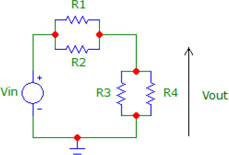

A friend who is studying Engineering at university asked me for help tutoring him for one of his degree projects where he was tasked with writing a voltage divider calculator:

<!-- more -->

> You are required to design a program to calculate the best possible standard resistors to use for a voltage divider circuit to get the required circuit gain. The circuit will contain 2 to 4 resistors as in the following circuit diagram.
>
> 
>
> ...
>
> The allowed resistors in kΩ are:  1.0, 1.2, 1.5, 1.8, 2.2, 2.7, 3.3, 3.9, 4.7, 5.6, 6.8, 8.2, 10, 12, 15, 18, 22, 27, 33, 39, 47, 56, 68, 82, 100, 1e9
>
> Note that the last resistor is 1 GΩ, to represent an open circuit. This is allowed because resistors R2 and/or R4 may not be required, in which case they may be replaced by an open circuit. Resistors R1 and R3 cannot be zero. Only resistors R2 and R4 may be this value.

There's some more explanation in the assignment, including information on how to calculate the resistance values p1 and p2, and the gain of the circuit.

In order to be able to help my friend with his assignment, I decided to get my head around the problem by coding it in Javascript. It took about half an hour to throw together a program that somewhat closely resembled what the lecturer is after. I then figured that with the magic of Vue, I should be able to write a component that dynamically calculates the answers as you type in your required gain. Here is the end result:

<code-divider-voltage />

## Code

:::: tabs

::: tab Node.js

This is the Node.js code I came up with initially to complete the task. It's not pretty, but it tries to follow the rules (e.g. passing by reference) and variable names set by the assignment:

<<< ./src/.vuepress/components/code/divider/index.js

Here's a more JavaScript native way of doing the same task:

<<< ./src/.vuepress/components/code/divider/better.js

:::

::: tab Vue

This is what the code looks like when converted into a vue component.

<<< ./src/.vuepress/components/code/divider/voltage.vue

:::

::: tab C++

Here's the C++ version of the code, as required by the assignment.

<<< ./src/blog/code/divider/ConsoleApplication1.cpp

This code was written in Visual Studio Community 2017, but also compiles in mingw and produces a 64kB [executable file](/media/programs/divider.executable) (rename this to .exe if you download it) with this command:

```shell
mingw ConsoleApplication1.cpp -o divider.exe
```

:::

::::
