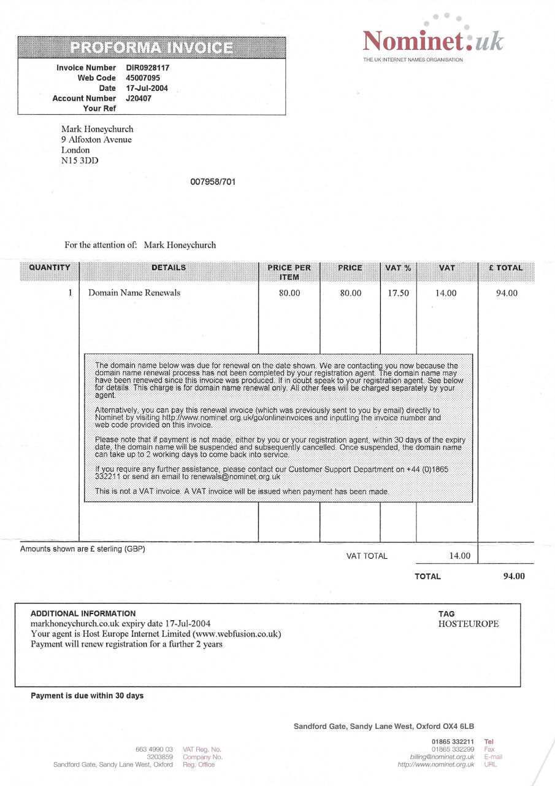
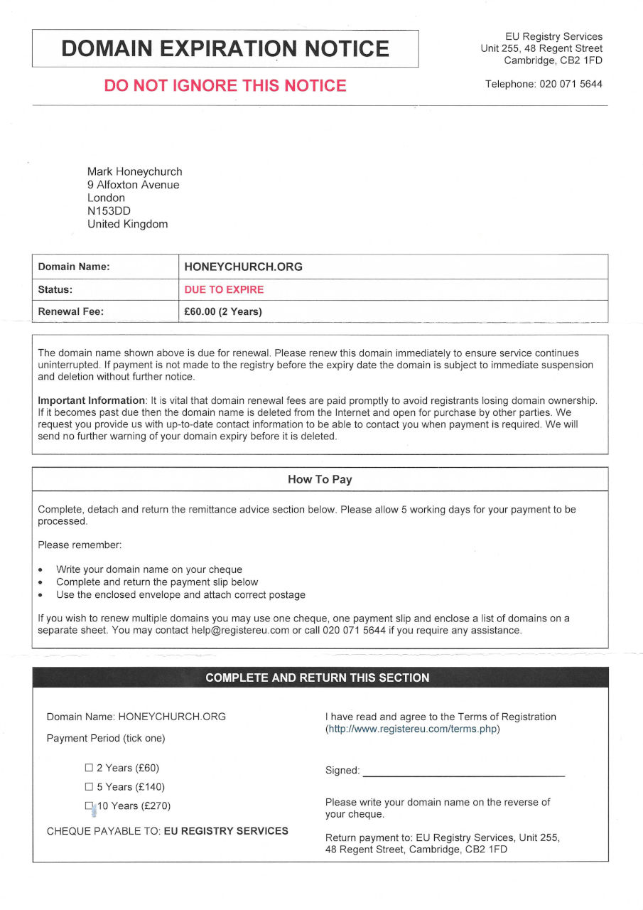
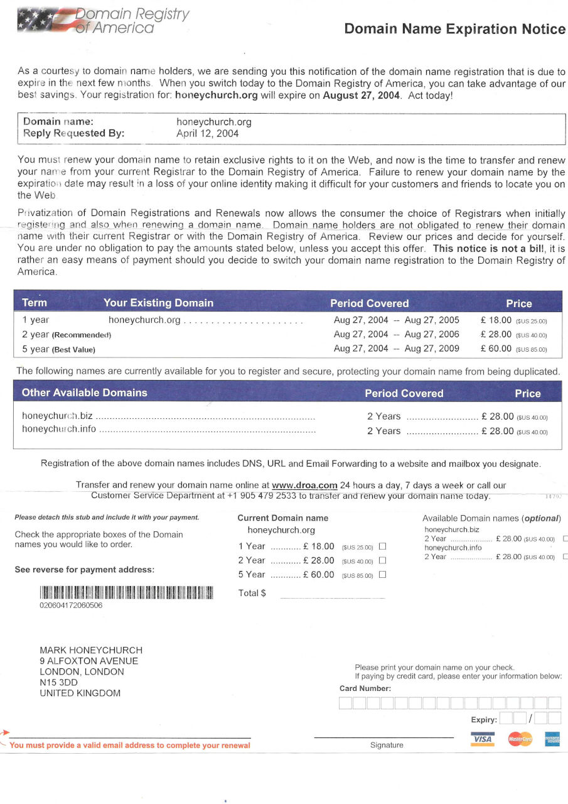

Domain Registrars seem to be willing to resort to some pretty underhanded tactics when it comes to making money from you. Often the price offered for a domain name for the first year changes for subsequent years, quietly and without warning. A £10 domain name can become a £20 domain name with no explanation, for example.

<!-- more -->

Another nefarious tactic that registrars seem happy to use is that of sending out an "Invoice" for a domain that isn't currently registered under them. The invoice is actually a combination of invoice and domain transfer, and the companies in question seem to be hopeful that you won't notice that they're not your current registrar, and that the price they're charging is likely more than you're paying with your current registrar. Here's a sample of the kinds of invoices I've received for my honeychurch.org domain, from Nominet UK, the EU Registry and the Domain Registry of America:

