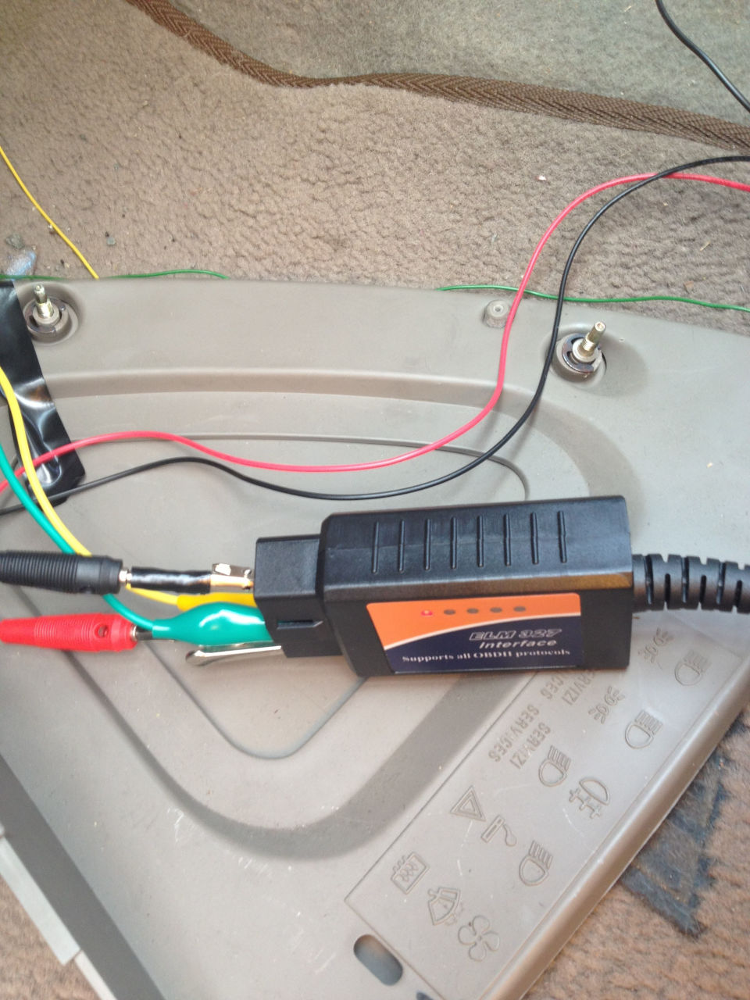
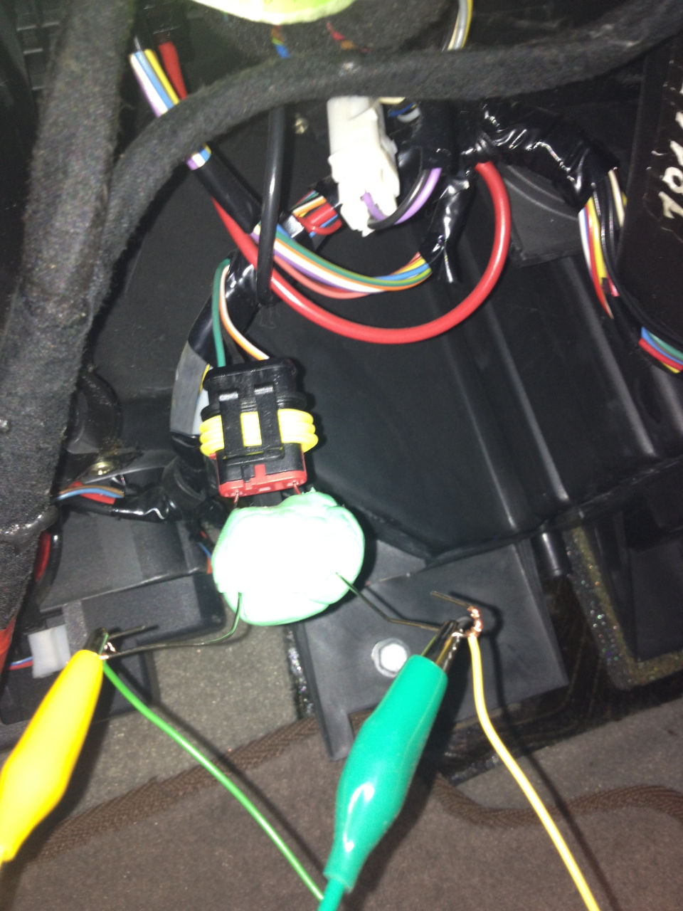
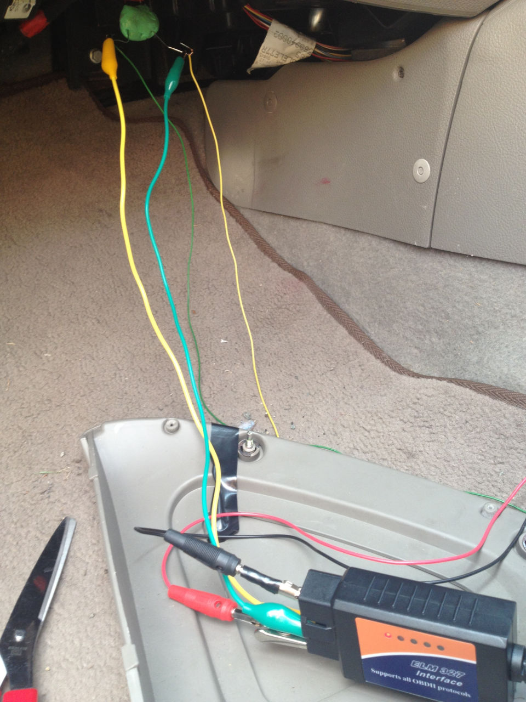

The warning light for the airbag on my Fiat Marea started lighting up, indicating a problem with the airbag. I read up on the issue, and found that it can be a problem with the wiring, and that once triggered the light would continue to illuminate until the fault was cleared in the onboard computer.

<!-- more -->

The first time I fixed this, I enlisted the help of a friend who borrowed an expensive diagnostic tool from his work. However, when it happened a second time I resolved to fix it myself.

## OBDII

I purchased an OBDII to USB tool, and found some free software that could talk to Fiat computers.

## Improvise!

Unfortunately the connector on the car was made before OBDII connectors were standardised, and I didn't have an adapter. Not letting that stop me, a couple of paper clips, some (green) blu tak
and a couple of crocodile clips solved the problem.

## Setup

Once my laptop was wired to the connector, clearing the fault code was pretty simple.

