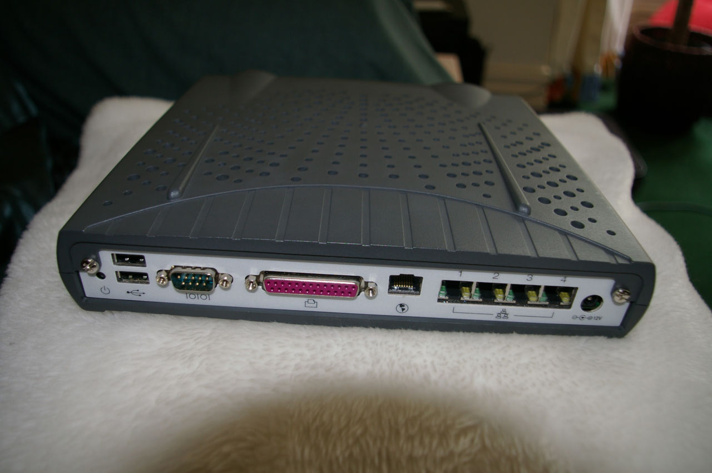
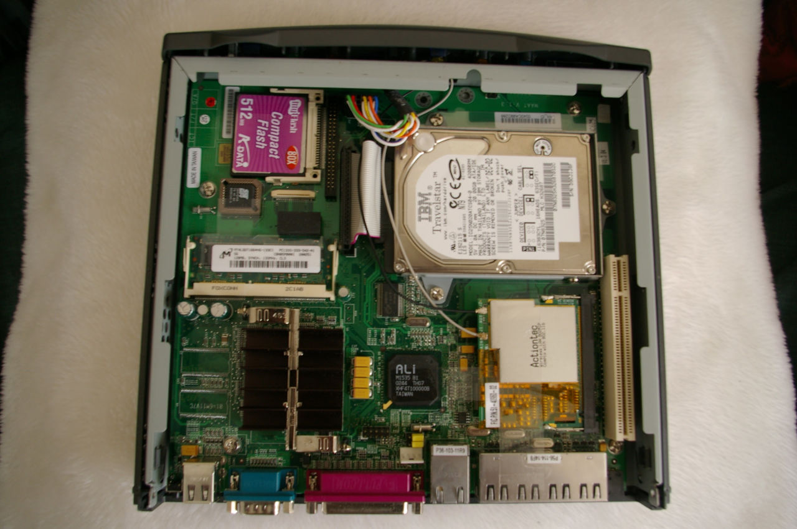
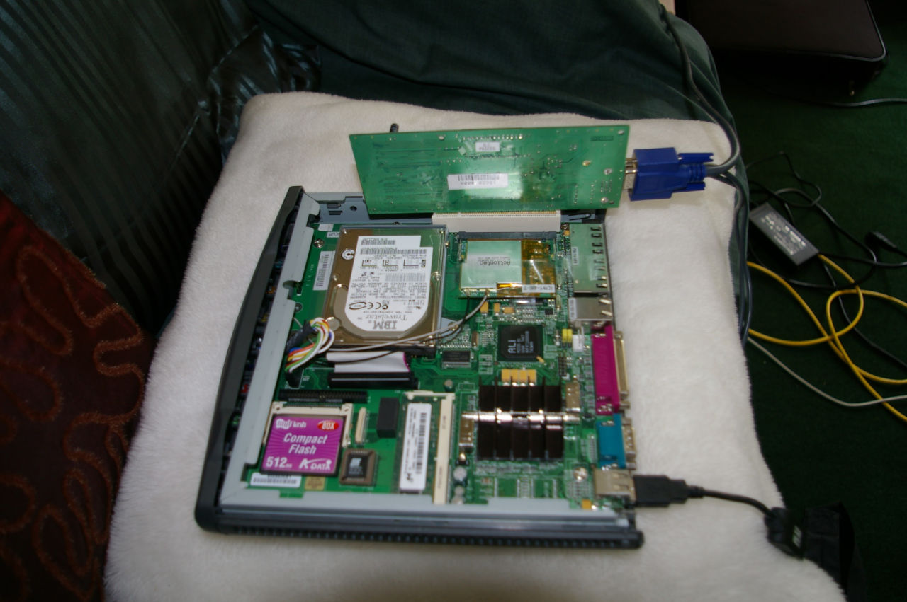

I recently bought a second-hand [IT-100 IT In A Box](http://www.emergecore.com/products/index.php) from [TradeMe](http://www.trademe.co.nz/) for NZ$180 - a bargain, as they retailed a couple of years ago for about US$1,500. The IT-100 is made by [EmergeCore Networks](http://www.emergecore.com/), and is basically a PC in a small box with a Wireless card (802.11b), 2 NICs (one as a 4 port switch), a parallel port and 2 USB ports.

<!-- more -->

The PC boots from a Compact Flash card (it comes with a 32Mb card installed) and also contains a 20Gb 2.5" Hard Drive. The Operating System is CoreVista, a variant of Linux created by EmergeCore Networks.

My plan was to install one of the popular flavours of Open Source firewall on the IT-100. My old firewall was a 400MHz PC with 2 network cards that ran [ipCop](http://www.ipcop.org/), a fork of the commercial product [SmoothWall](http://www.smoothwall.com/). In looking for a Compact Flash version of ipCop, I found [M0n0wall](http://m0n0.ch/), which is a FreeBSD-based solution with much greater functionality than ipCop or Smoothwall. The [M0n0wall CompactFlash image](http://m0n0.ch/wall/download.php?file=generic-pc-1.22.img) is only 5Mb, so I downloaded and wrote it directly to a 32Mb CompactFlash card I had spare using [physdiskwrite](http://m0n0.ch/wall/physdiskwrite.php).

Only 2 screws need to be unscrewed to allow the side cover to be removed. The removal of another 2 screws allows the rear plate to be removed, facilitating use of the PCI slot. I inserted the CF card into the box and plugged a graphics card into the PCI slot.

On booting, m0n0wall picked up the 2 NICs and the wireless card. I selected the interfaces for each device, with rl0 being the WAN interface, rl0 being the LAN interface and wi0 as the OPT1 (optional 1) interface

Having got this far, I found [pfSense](http://www.pfsense.org/), a derivative of m0n0wall with 3 major differences:

- Based on FreeBSD 6.1 CURRENT, rather than m0n0wall's FreeBSD 4.11

- Uses OpenBSD's Packet Filter firewall, a fully-featured and secure firewall which I've had a lot of experience configuring in the past few years

- Has lots of additional packages for VPNs, failover, load balancing and the like
