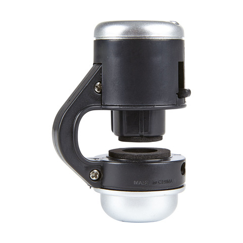
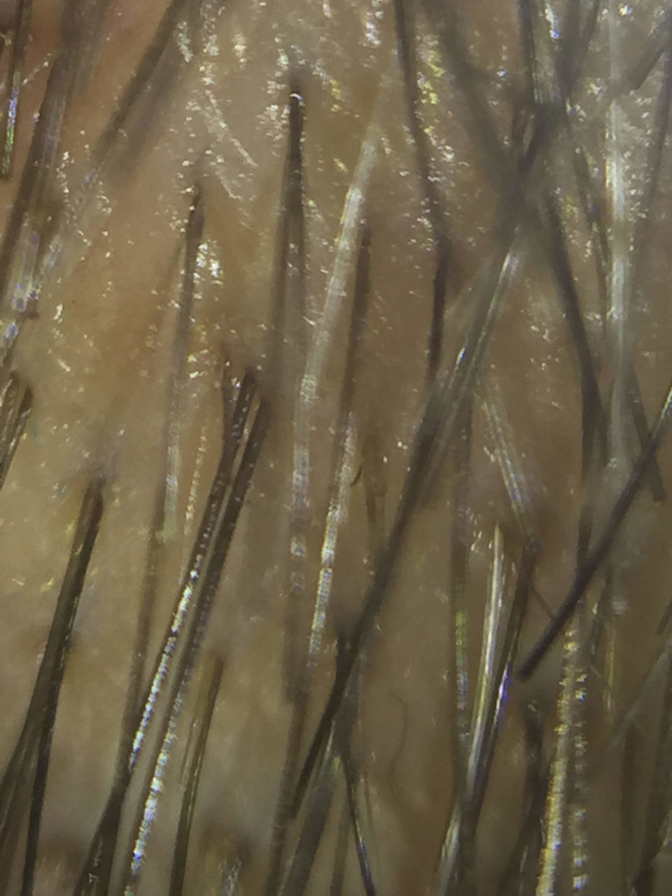
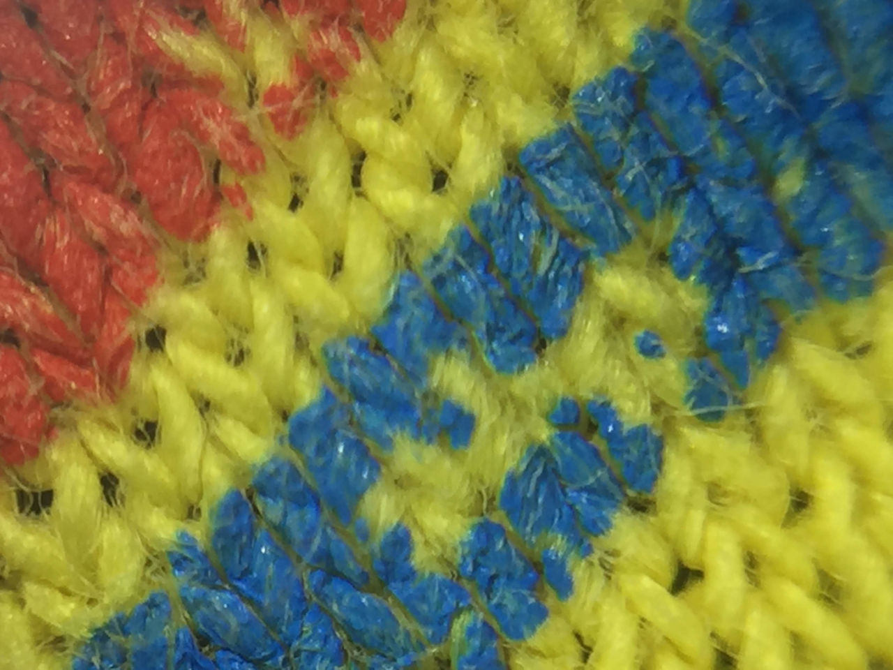
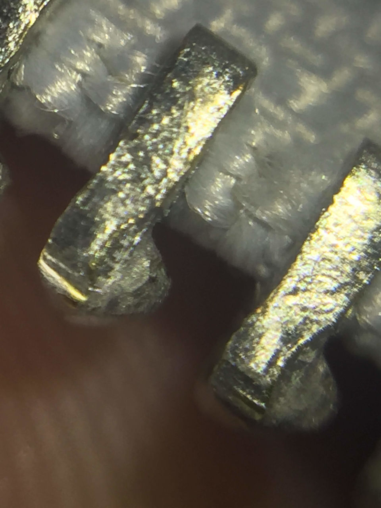
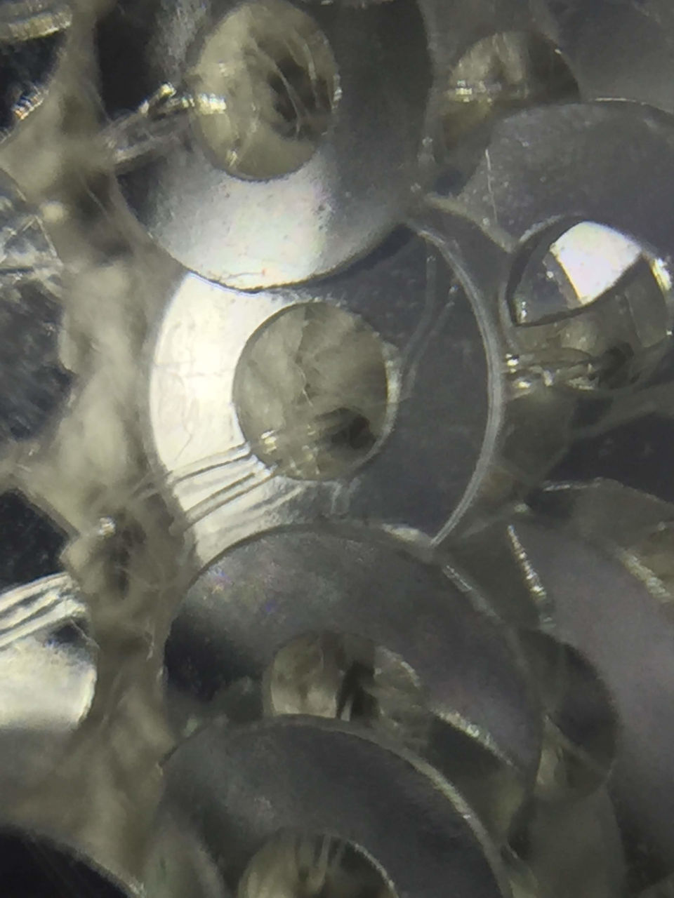
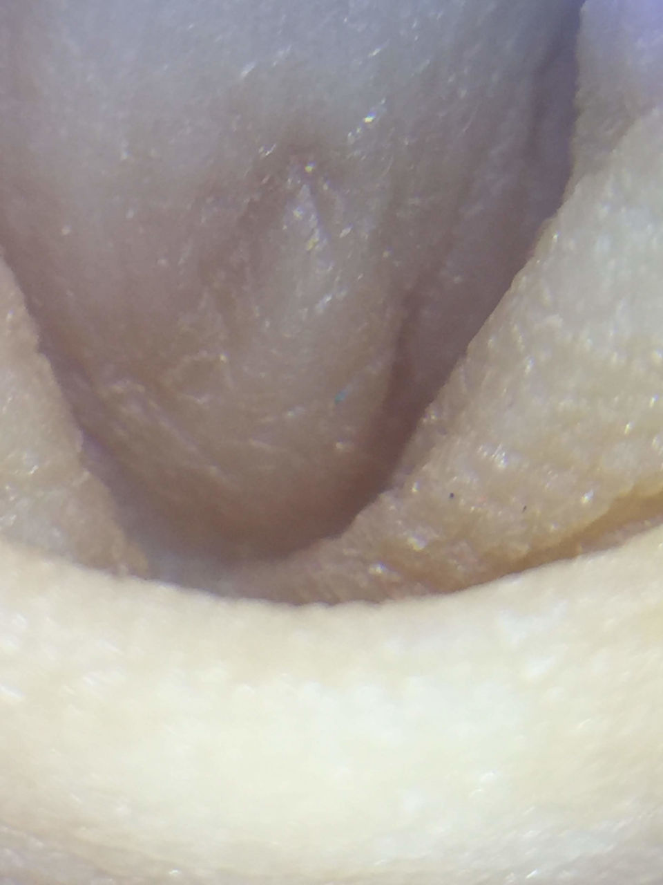
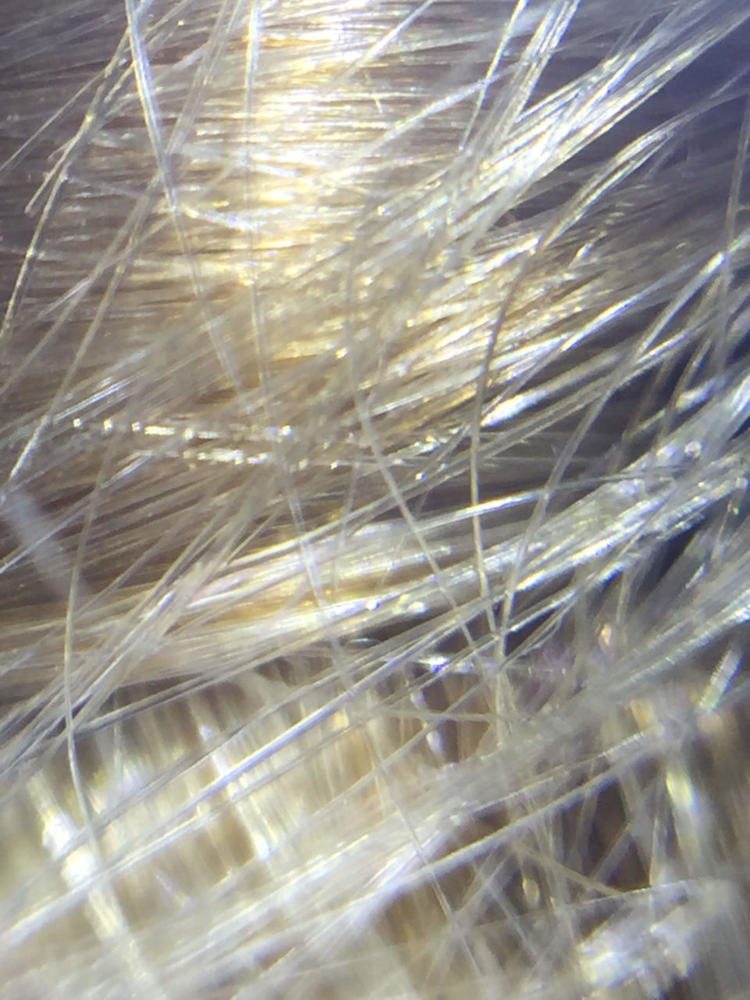
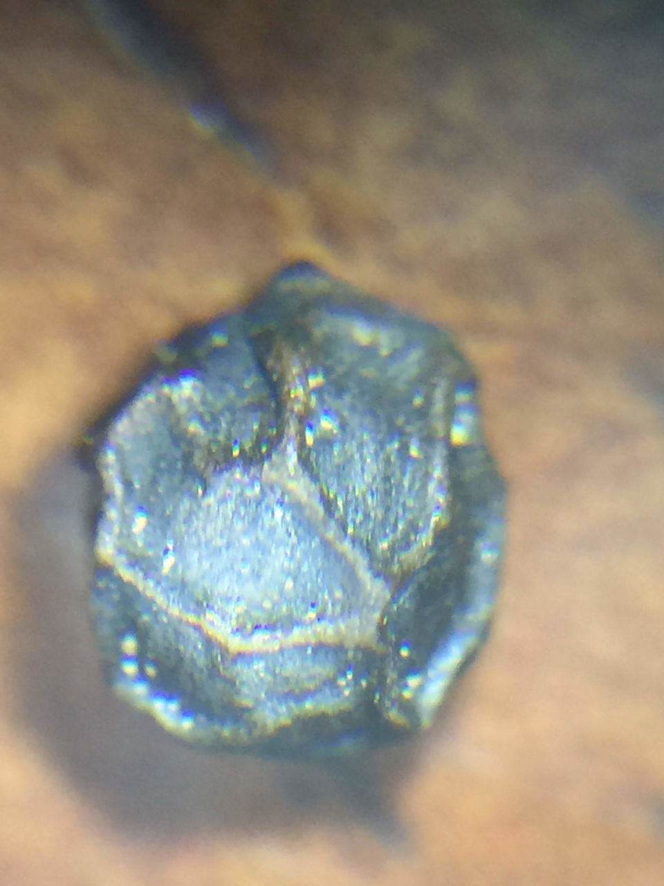
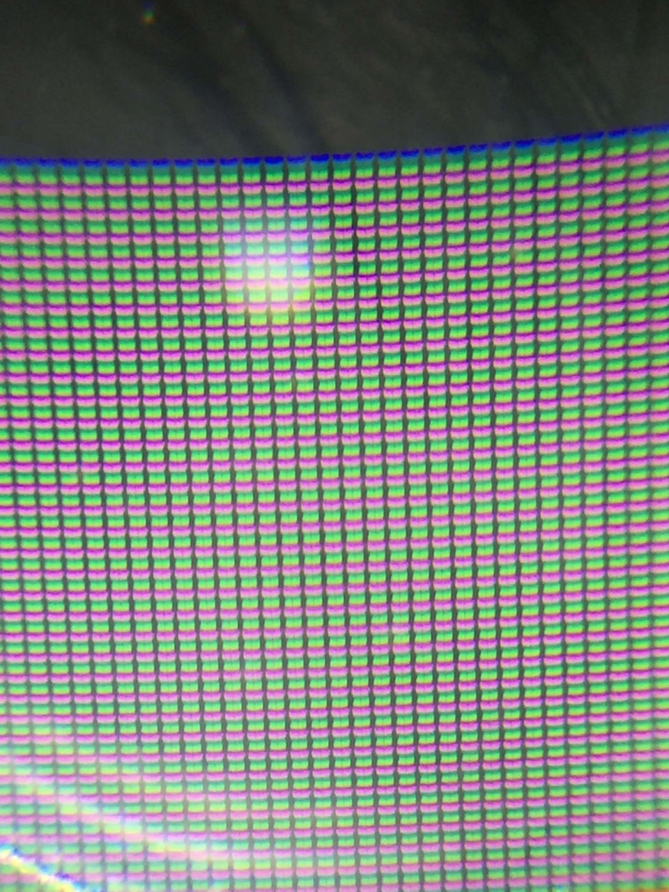
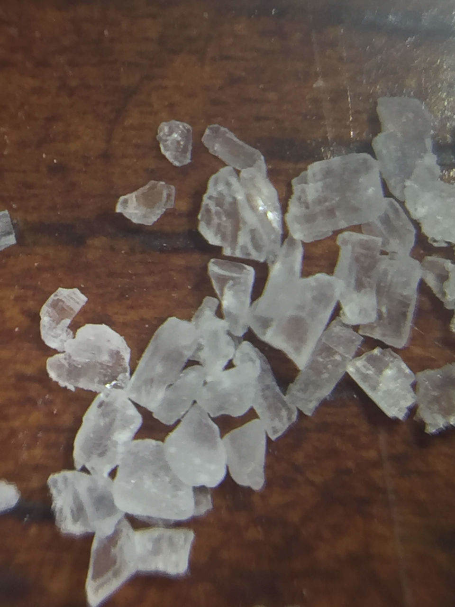

I picked up a $5 [microscope adapter](https://www.kmart.co.nz/product/smartphone-microscope-converter/1002307) for phones from Kmart.

I was doubtful that it was going to be any good, but was pleasantly surprised by how well it worked.

The kids and I had fun taking pictures of various household objects and body parts. Can you figure out what these are?

## Guess What

