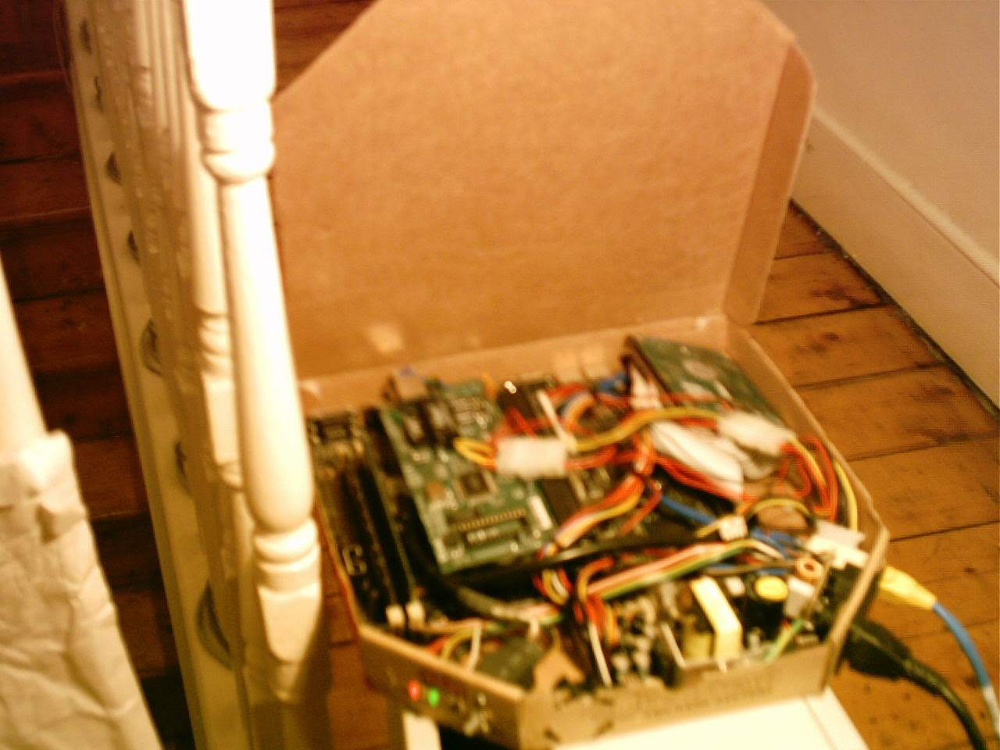
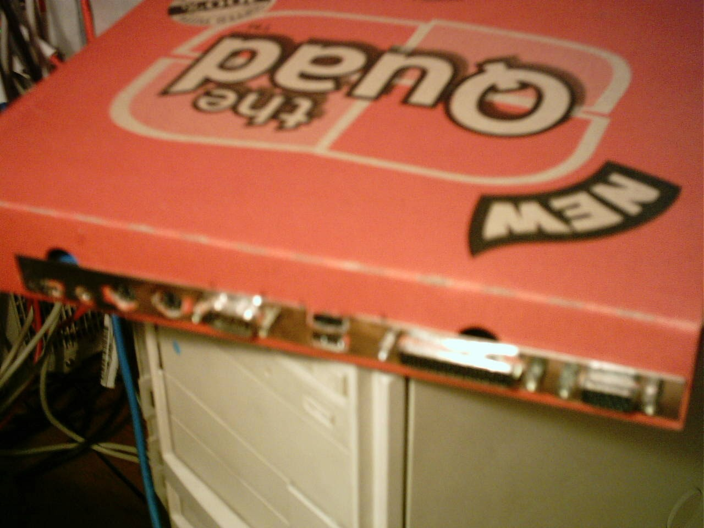
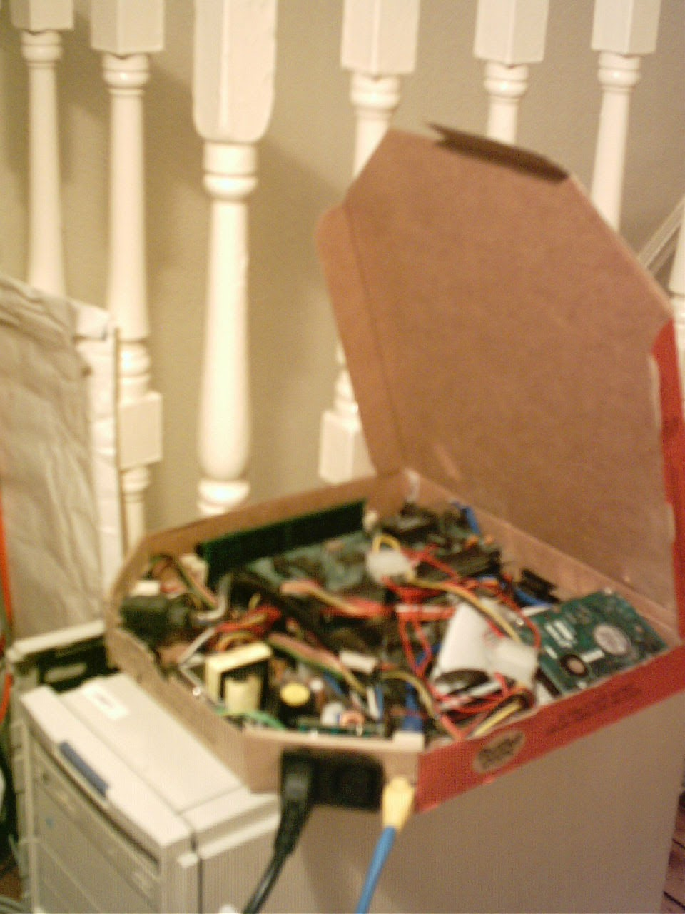
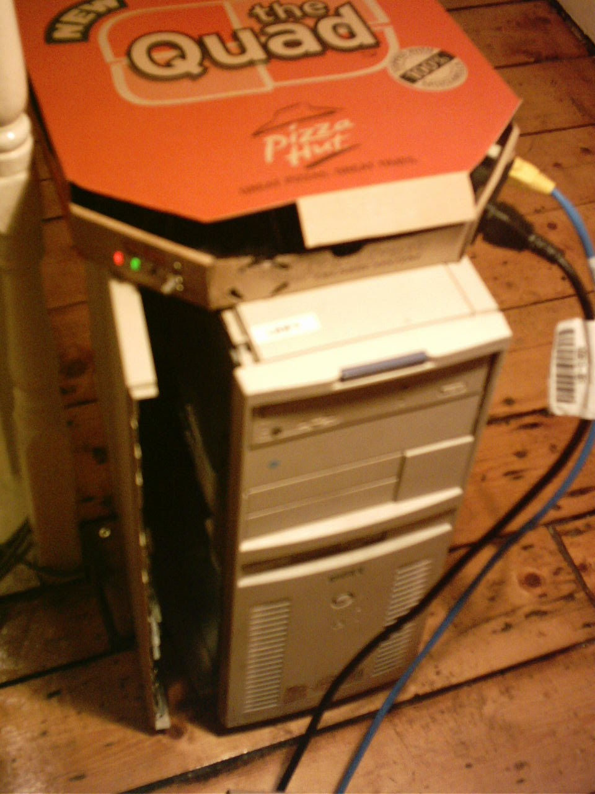

My first web server was a 233MHz Pentium PC squeezed into a small Pizza Hut pizza box.

<!-- more -->

## Rear

I mounted the rear ports to the back of the pizza box.

## Front

The power supply was disassembled to make it easier to fit and attached to the front of the box. I also added a network card to the ISA riser and internally routed the network port to the front of the case, next to the power connector.

On the other side of the front of the case, I mounted the power and HDD LEDs, as well as the power and reset switches.

