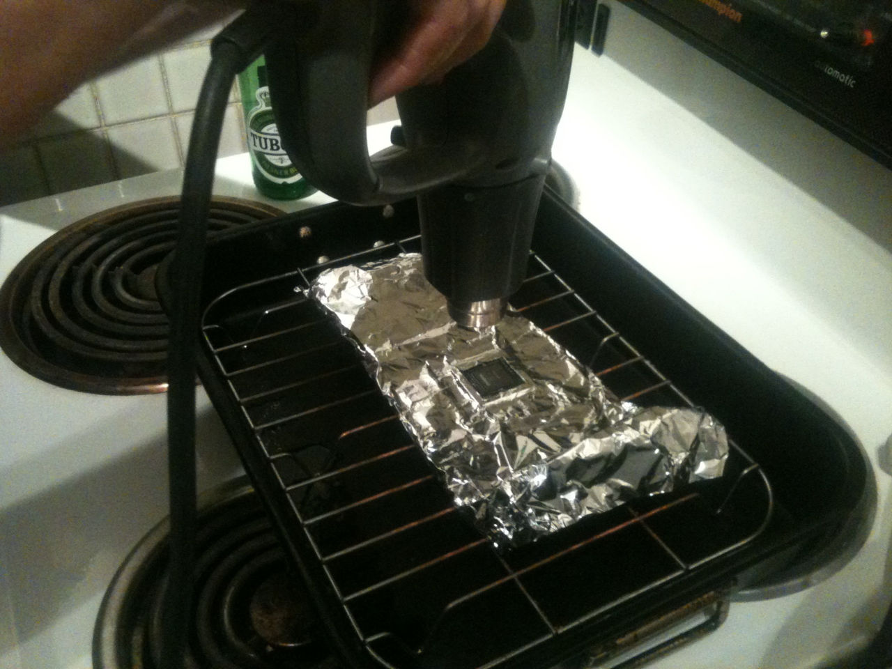
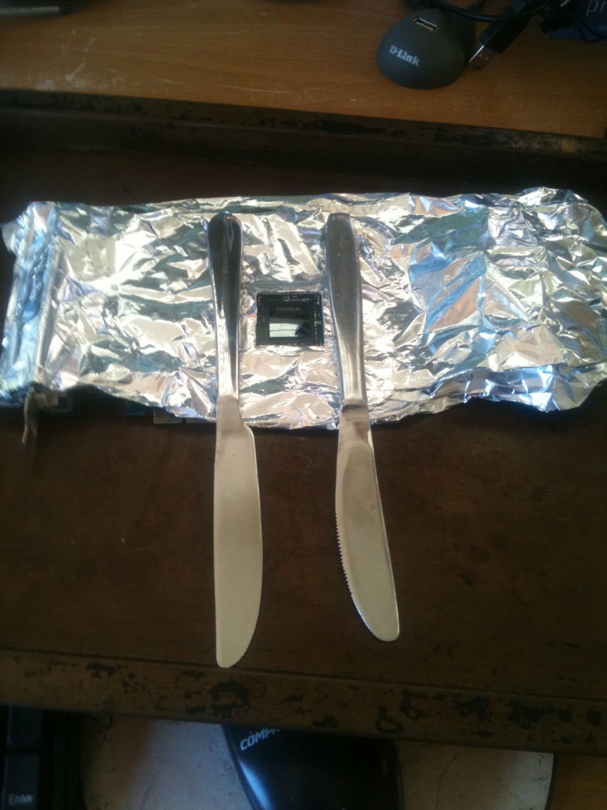
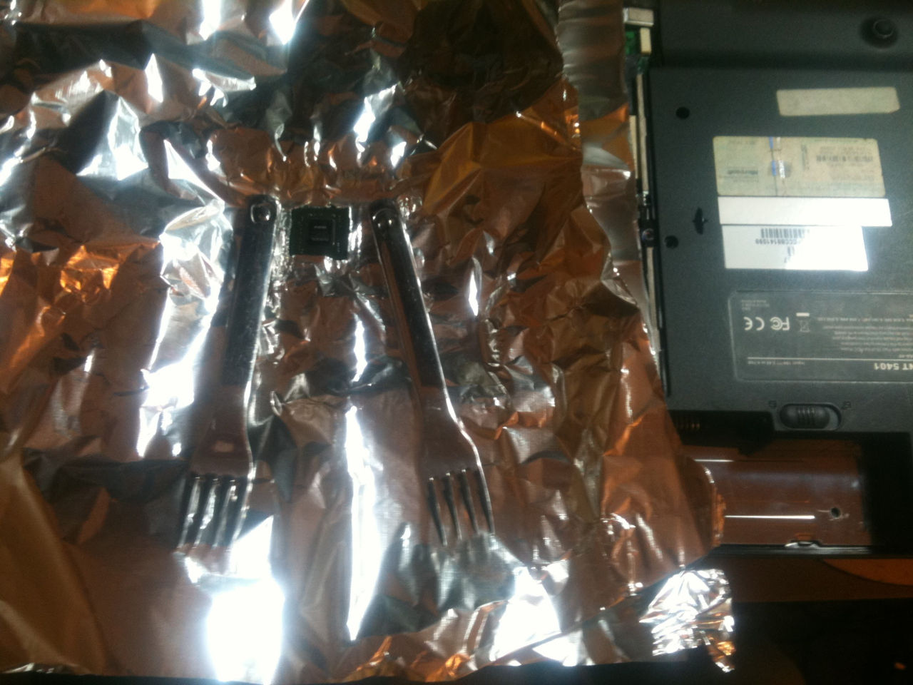

I've managed to fix a few NVidia 8000 series devices that suffered from bad solder joints by heating the chip until the solder reflows. I used tin foil to protect the rest of the device from the heat, and heated with both an oven grill and a heat gun.

<!-- more -->

## Graphics Cards

This is an NVidia graphics card:

And this is another:

## Laptop

And this is a laptop with integrated GPU:

Some of the devices worked okay after the fix, whereas others worked for a few days and then started failing again.
