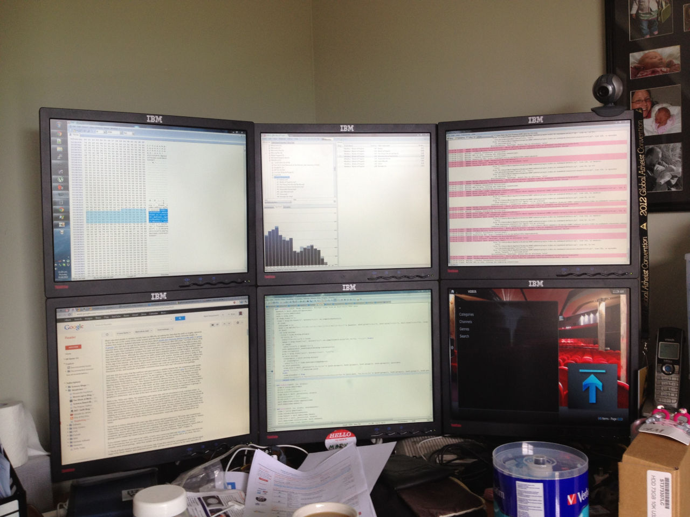
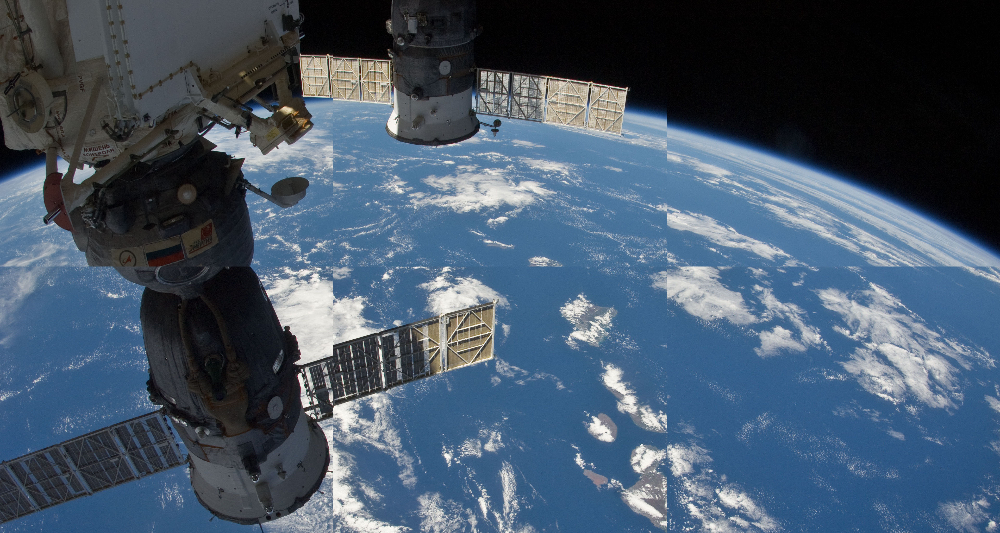
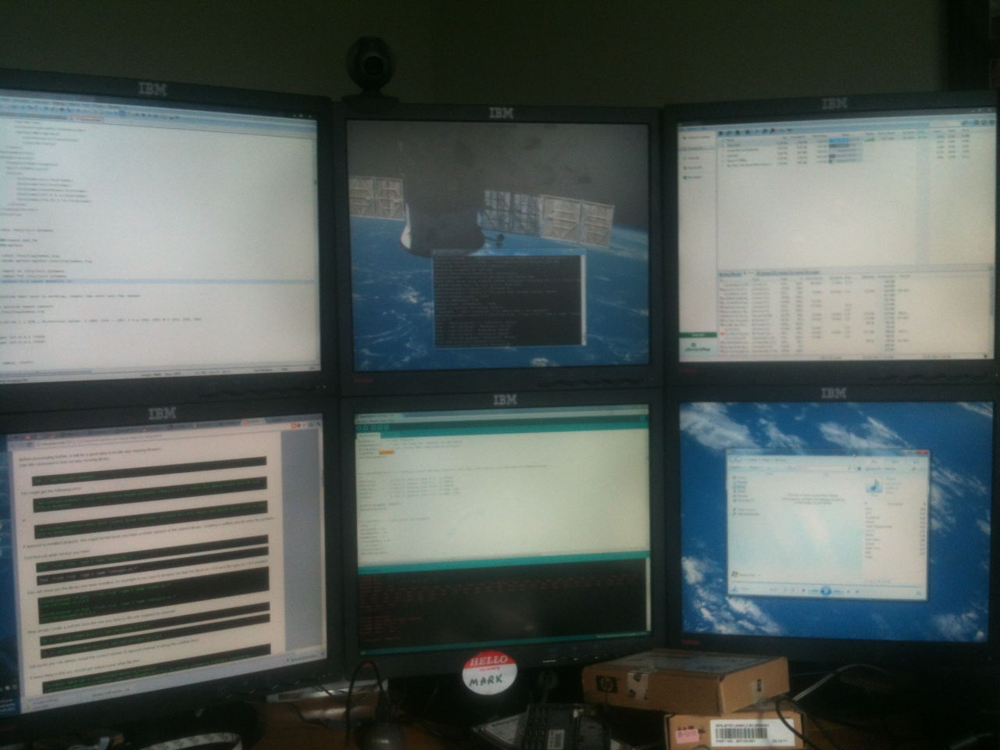

My desktop PC has 4 NVidia Quadro NVS 290 PCI-E graphics cards. They're not great, but three of them were free, and along with a whole bunch of free monitors (1280 x 960) from a work customer I managed to put a six screen setup.

<!-- more -->

I ended up making a wallpaper of the International Space Station (ISS) that covered all six monitors. The only problem was that the bezels of the monitors meant that the image looked odd. To fix this, I measured the size of the bezels and the screens, and deleted sections of the image so that it would sit properly in the six screens.

The fourth Quadro card (each one can support 2 monitors) is for a 40" TV I have mounted on the wall to the right of the monitors.

