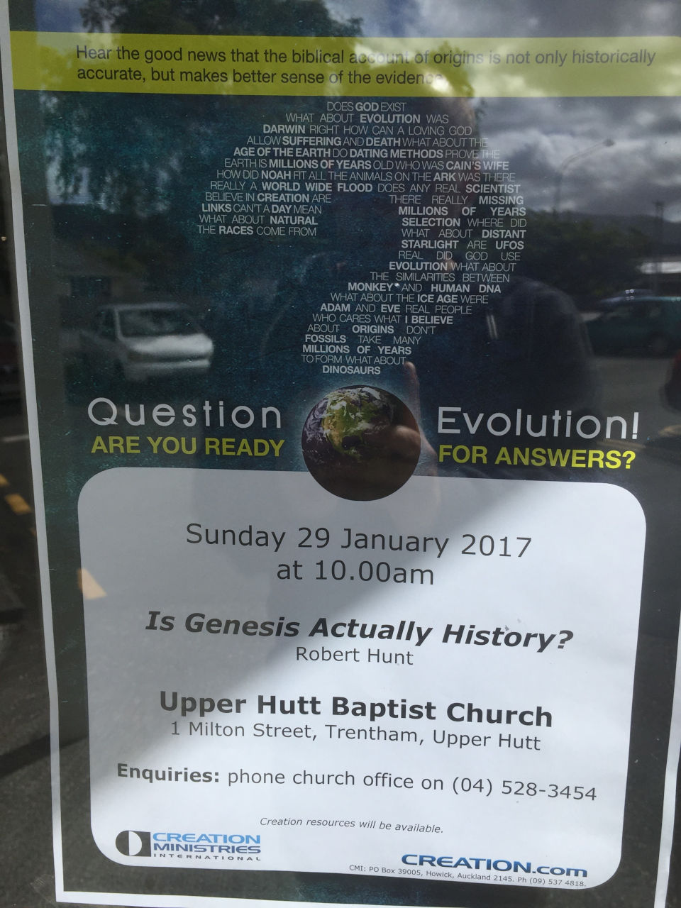
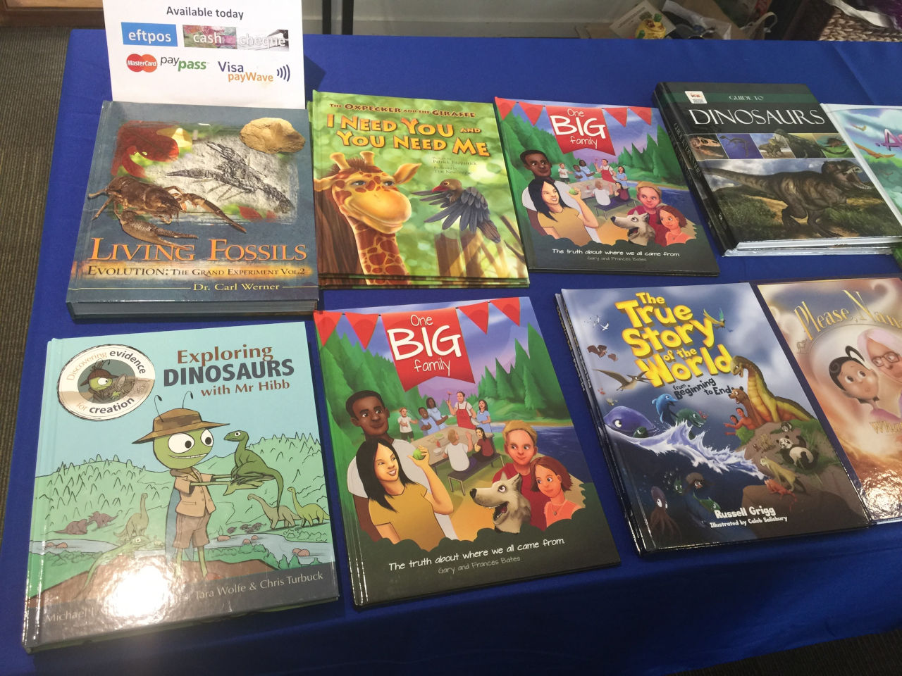
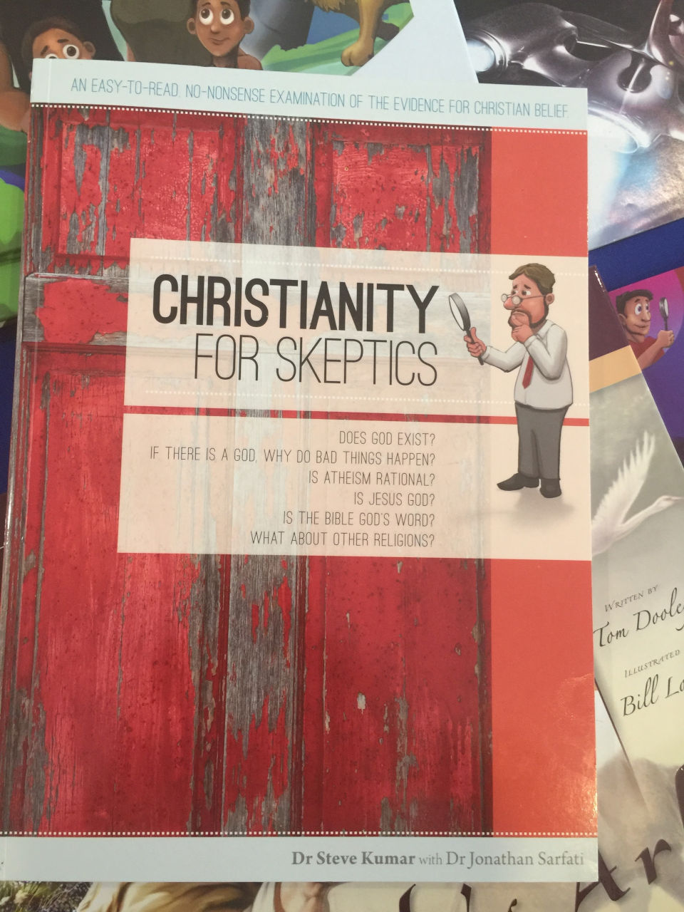

Robert Hunt spoke on behalf of Creation Ministries International this morning at Upper Hutt Baptist Church.

<!-- more -->

The service started off with some singing, and then Robert was introduced.

Robert started by saying that the bible is under attack by people who claim that the events described in it are not literal, and teachers who teach that we are a product of evolution.

He then went on to describe the prevailing theory of how the universe has "evolved" in the last 13 million years, and did a fairly good job of describing how we ended up with life on earth. However, he followed this up by explaining that this contradicts the beginning of Genesis, where the bible tells us that the earth was created before the stars, and that therefore Christians need to accept the biblical view even if it doesn't fit with the evidence.

He talked about the earth, and about how science thinks that it started off as a hot, glowing ball of matter. He explained that this couldn't be the case, as Genesis I says:

> "the earth was formless and empty, darkness was over the surface of the deep, and the Spirit of God was hovering over the waters"

Taking these words literally would mean that any liquid water would have boiled off from a hot early earth, therefore science must be wrong as it contradicts the bible.

Of course, if we don't take the bible's words literally this is no longer a major problem. We don't know for sure about where the water on earth came from, but there are [some good theories](https://en.wikipedia.org/wiki/Origin_of_water_on_Earth).

Robert explained that if all living creatures are related, and related to us, due to evolution, then if we eat cows or lettuce we must be cannibals - as we are related to them!

<audio controls src="/media/audio/skepticism/RobertHunt.mp3" />

This was followed by the assertion that some scientists are suggesting that we need to cull the human population, and this is one of the reasons that secular people support abortion. The idea of population culling is not one that is accepted in science, although there is general consensus that we need to ensure the population does not increase uncontrollably.

Next up was the argument that because we are creative, this is proof that we were created in the image of God - who is also creative. Also because we find flowers and sunsets beautiful, this is further proof that we are made in God's image.

This sounds a lot like kiwi Ray Comfort's argument, stolen from Paley, that things which [look designed have a designer](https://en.wikipedia.org/wiki/Argument_from_beauty). A more likely explanation is that we find nature beautiful because we have evolved around nature, and that beauty is just one of a range of emotions we feel for things we see every day.

One of the daftest arguments was that our calendar proves that the bible is true. Firstly, because the year is based on the birth of Jesus - 1AD - the Jesus story must be true. Secondly, the fact that calendars have 7 days - the six days of creation and one day of rest - the Genesis story must also be true.

<audio controls src="/media/audio/skepticism/RobertHunt2.mp3" />

Robert has obviously got himself a bit confused here! Yes, our years are based on a Christian timeline, and our week is based on a Jewish calendar and probably came from the Genesis story, but to then argue that this proves the stories to be true is circular reasoning.

He also ignores the many parts of our calendar that come from beliefs that are not Christian, such as the days of the week being named after Anglo-Saxon, Norse, Germanic and Roman gods, and some of the months being named after Roman gods.

Robert argued against old earth Christians using 2 Peter 3. This is often used to explain how Genesis may be true while the earth is old, because verse 8 starts with:

> With the Lord a day is like a thousand years

However, the full verse is:

> With the Lord a day is like a thousand years, and a thousand years are like a day.

Therefore, apparently, this cancels itself out!

Robert explained that the extreme longevity of early biblical characters meant that biblical accounts are trustworthy, as you only need to pass on stories from Adam to Lamech (Noah's father), to Noah and then to Abraham to cover the first 2 thousand years from 4000 BC.

He finished by talking about how there was no death before the garden of eden, and that Christians do a disservice to their beliefs by characterising noah's ark in a cartoony way as a kids' story, along with the usual nonsense about the ark holding juvenile dinosaurs, and there only being 25 species of dinosaur, etc. I've heard this before - I think it's a way for creationists to take on the appearance of being serious.

As usual, there was a push to sell creationist materials, including tables filled with books and DVDs.

It was interesting that in the church newsletter it talked about how creationism is a controversial idea, and that not everyone will agree. I talked with Robert about this, and he said that he thinks Christians need to take a stand be open and honest about creationist beliefs.

This was one of the worst creationist talks I've heard - I've seen John MacKay, Jonathan Sarfati and others speaking in the past, but Robert had some really weird, backward arguments!

