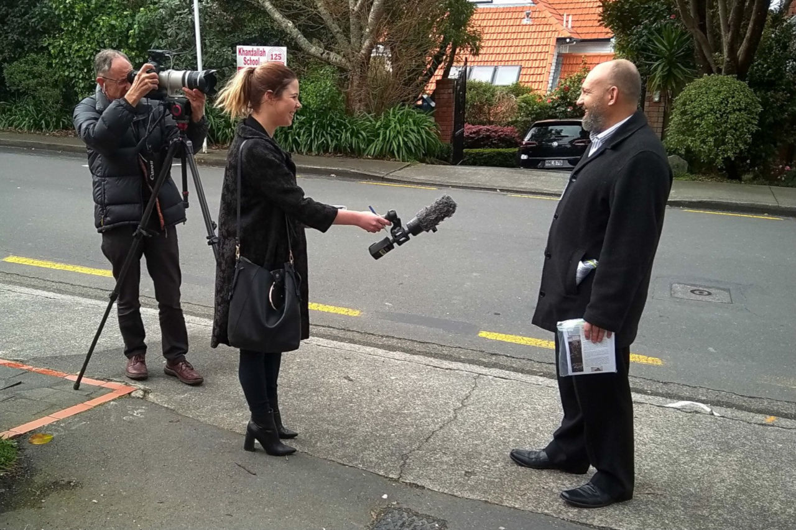
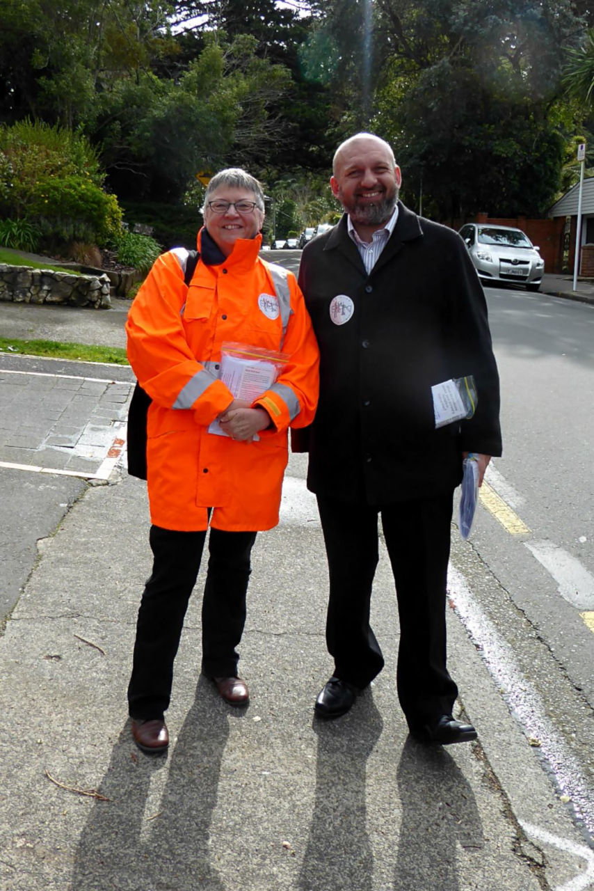
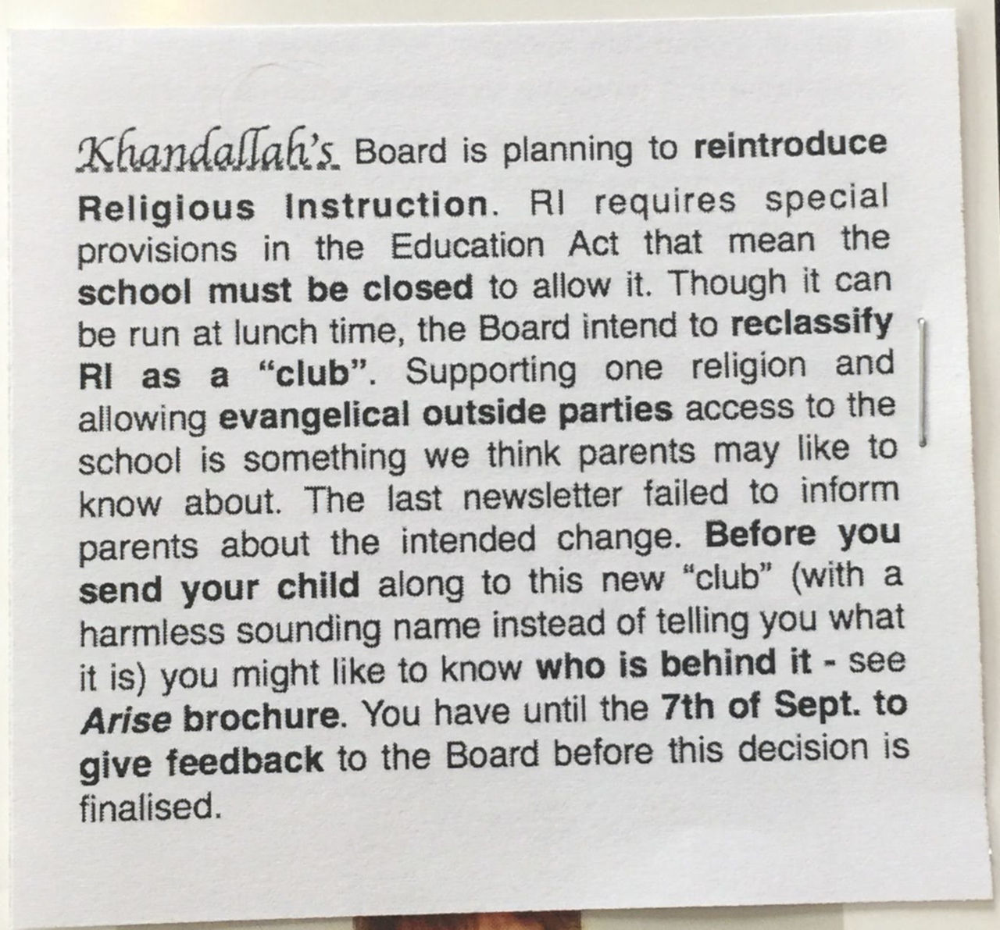
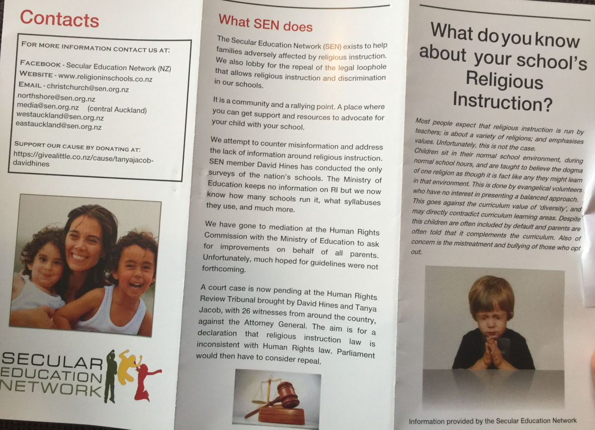
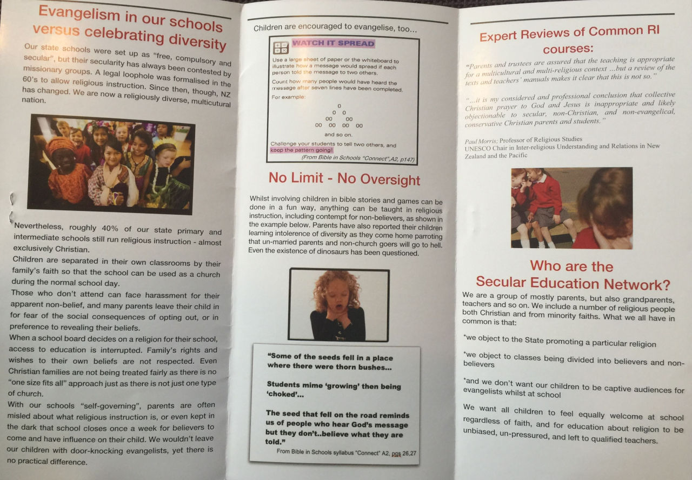
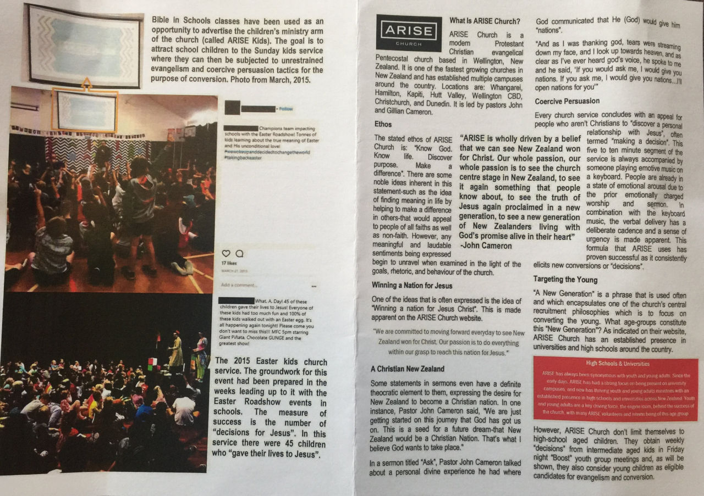
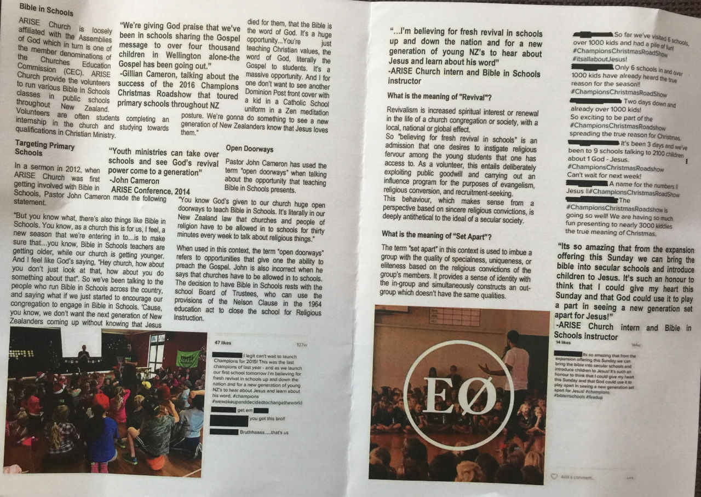

On Friday afternoon [I headed out to Khandallah School](https://www.stuff.co.nz/national/education/106744580/reading-writing-and-god-at-wellingtons-khandallah-school) in Wellington as part of the Secular Education Network. SEN believes that schools should be secular, and that there is no place in our school system for Religious Instruction.

<!-- more -->

There's a lot of confusion about what Religious Instruction (RI) is. Many people think that it's lessons for kids about different religions, but unfortunately that's not the case - that's Comparative Religion. RI is the teaching of one religious belief as fact - it's seen by churches as a way of converting young people into the faith. And, of course, in the long run it pays off for a church if they can attract new young members.

SEN was contacted recently by parents at Khandallah School because of their concerns about the reintroduction of RI. The parents of some of the children at Khandallah School go to an evangelical church in Wellington, Arise Church, and there's been a bit of a rocky history with Religious Instruction being allowed in the school, with the school previously doing a pretty bad job of notifying school parents about the course and its content.

Some of the concerned parents have formed a group, called Keep Khandallah School Secular, where they believe that religion has no place in their kids' school. One of the parents found out recently that, despite promises that any decision making around bringing RI into the school would be open and transparent, the school Board of Trustees was quietly bringing in a new school "[clubs policy](/media/docs/skepticism/ClubsPolicy.pdf)" which contains a paragraph about explicitly allowing religious based groups into the school. Interestingly, I've heard that one of the school Board members is part of the Arise Church leadership team, and has been instrumental in pushing for RI to be allowed at the school.

The concerned parents decided that they needed to let all parents at the school know about this proposed new policy, so that everyone could have their input. However, they were concerned about backlash from other parents. One of the things that RI in schools tends to cause is a fracture among parents. Often in schools there are a few parents who are actively opposed to RI, and those parents are normally made to feel like their views are not welcome. In urban schools such as Khandallah, where there are parents of many different faiths, RI tends to be more divisive, and some of the parents at Khandallah had already received negativity from the Board and other parents because of their view that the school should be respectful of all beliefs, and not just aid the promotion of a single evangelical Christian belief.

So this is where SEN comes in. It was great for us to be able to offer material support, as it's a lot less stressful for us to stand outside the school at 3pm handing out flyers that it would be for the parents of kids at the school. We were able to help the parents inform their peers about this issue, without suffering any backlash. Four of us met and headed to the school just after 2pm:

We handed out several flyers - an overview of Religious Instruction in schools and why it's a problem, some info about what's happening at Khandallah, details of Arise church's view on RI, and a copy of the school's proposed new clubs policy.

### The Policy

####

> Religious Clubs
>
> A part of Hauora recognises the need for spiritual well-being. This encompasses the values and beliefs that determine the way people live, the search for meaning and purpose in life, and personal identity and self-awareness (For some individuals and communities, spiritual well-being is linked to a particular religion; for others, it is not).
>
> In addition to the expectations set out for clubs above, any club that is about religious instruction must also:
>
> - Only educate children about values and beliefs but never evangelise.
> - Use a roll and only include those who have been opted in by their parents or caregiver.
> - Operate a programme for no more than 30 minutes per week within Khandallah School.
> - Only run while the school is closed for instruction (e.g. Lunchtime).

<object data="/media/docs/skepticism/ClubsPolicy.pdf" width="100%" height="800px" />

I've been told that when these rules have been enforced in the past, it was by a teacher who sat in on the classes. However, the teacher who volunteered for this is a member of Arise church! Children also reported to their parents that the Arise instructors were evangelising.

Most people were either happy to listen to us and take our flyers, or were nonplussed. It's a hard thing to stand outside a school giving out flyers, and several parents seemed to think that we were trying to push religion into schools - we had to make sure that the first sentence out of our mouths made it clear that we were worried about religion in schools, and that we were not from a church!

A couple of parents seemed unhappy about what we were doing. One I talked to was fairly well versed about the situation, and thought that the school has done enough to safeguard children. Another told us that we should "live and let live", which is kind of ironic given that Arise church are doing the opposite of this and being very proactive about getting into schools.

An ex Arise church member called Josh did a great job of putting together some of the audio from sermons given at the church on the topic of their efforts to get children into schools:

@[youtube](https://youtu.be/wOU-kJhz1c4?t=1m33s)

John Cameron, who talked about how churches have a right to teach the bible in schools, obviously hasn't done his homework. There is a part of the Education Act that allows religious instruction, but only because of a technicality that the school can be considered "closed" for the time that RI is taught. But there's no "right" for a church to have access to a school - it's something that the Board of Trustees has to decide on, on a case by case basis.

I've heard that, although Arise has been running RI classes at Khandallah School up until now, it may be that another church takes over that role in the future. I'd much rather see that no religious group is given access to primary age children, and that kids are left to make their own choices about their beliefs at a time when they're mature enough to decide for themselves.
